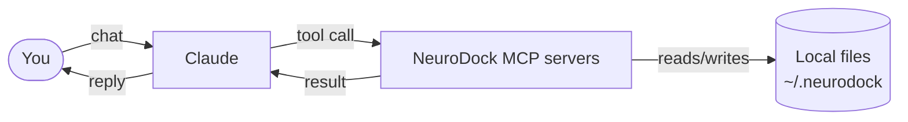
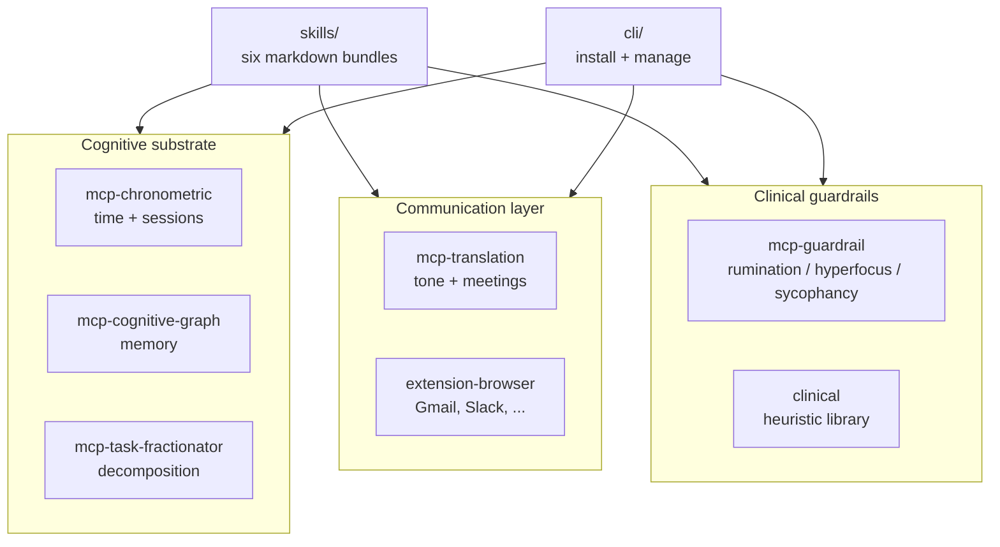

# NeuroDock

> **Open-source, MCP-native, vendor-neutral, local-first cognitive substrate for neurodivergent people.**

## 5-second TL;DR

- **What it does:** gives Claude a memory of your work, a sense of time, a refuse-rumination guardrail, and a translator for corporate ambiguity.
- **Who it's for:** neurodivergent people — self-ID only, no diagnosis required, no gatekeeping.
- **How to install:** one command, below.

NeuroDock plugs into Claude Desktop / Claude Code / Cursor (any MCP-aware
client). Local-first by default. No telemetry. AGPL-3.0-or-later.

## How it fits together

Quick picture before the install steps. Read left-to-right: you talk to Claude
like normal, and Claude quietly calls NeuroDock's local tools to do the
remembering, timing, and translating.



Everything runs on your laptop. Nothing leaves your machine unless you
explicitly turn on a cloud option.

## Install

```sh
npx --yes @neurodock/cli install-all
```

That's it. One command. It pip-installs the six MCP servers, wires
Claude Desktop / Claude Code / Cursor, and drops a starter profile at
`~/.neurodock/profile.yaml`.

**Then restart Claude — full quit, not just close-window** (this is the
#1 silent failure). Claude only reads its MCP config at startup. On macOS
that's Cmd+Q; on Windows, kill it from the system tray.

Requires Python 3.11+ and Node 22+. Works on macOS, Linux, Windows.

Then in any conversation, try:

```
What was I working on yesterday?
Plan my morning.
Decompose this goal into atomic tasks.
```

Claude calls the MCP tools under the hood; you just talk.

<details>
<summary><strong>Want to install it step-by-step instead?</strong></summary>

NeuroDock ships across two registries: the Python **MCP servers** (MCP =
Model Context Protocol — the standard that lets Claude call local tools)
on PyPI, and the user-facing **CLI** on npm. The CLI wraps everything else.

**1. Install the six MCP servers**

```sh
pip install neurodock-mcp-chronometric neurodock-mcp-cognitive-graph neurodock-mcp-task-fractionator neurodock-mcp-translation neurodock-mcp-guardrail neurodock-evals
```

**2. Wire them into your MCP-aware client**

```sh
npx --yes @neurodock/cli init
```

Detects Claude Desktop, Claude Code, or Cursor and writes the server
entries automatically.

**3. Restart Claude** (full quit — see the warning above).

**About the `neurodock` command** — it lives on npm as `@neurodock/cli`,
**not** on PyPI. The `pip install` step gives you the MCP server binaries
that Claude calls over stdio; the CLI is separate. Two ways to run it:

```sh
# Option A — run via npx, no install
npx --yes @neurodock/cli doctor

# Option B — install once, call 'neurodock' from anywhere
npm install -g @neurodock/cli
neurodock doctor
```

`@neurodock/cli` exposes: `init`, `doctor`, `validate`, `update`, `uninstall`,
`host install`, `host uninstall`, `profile show`, `profile validate`,
`install-all`, `examples`, `plugin add/remove/list/enable/disable/validate`.

Want to see it work without installing from PyPI/npm at all?
`TESTING_LOCAL.md` walks through the from-clone path.

</details>

## See it in action

_(demo GIF coming — see [issue #27](https://github.com/tlennon-ie/neurodock/issues/27) — until then, try the [Claude Desktop walkthrough](./examples/claude-desktop/README.md))_

## Browser extension (optional)

There's also a browser extension that translates corporate-speak inline on
Gmail, Slack, Linear, Notion, GitHub, Google Docs, and Outlook. It calls
the same translation tools the MCP server exposes, but surfaces them
where you'd actually use them — a floating Translate button plus a
right-click menu — so you don't have to context-switch back to Claude
just to decode "let's circle back on this."

You pick the LLM provider. Five options: Ollama (local, default), LM
Studio (local), OpenRouter (including its auto-router), Anthropic, OpenAI.
The API key, if you need one, stays in `chrome.storage.local` and never
leaves the device.

Store submission is still pending (the `packages/extension-browser/store-listings/`
prep is done, the developer accounts aren't). Until then, load it
manually:

1. Build it: `pnpm --filter @neurodock/extension-browser run build`
2. Chrome / Edge: go to `chrome://extensions`, turn Developer mode on,
   click **Load unpacked**, and pick `packages/extension-browser/.output/chrome-mv3/`.
3. Firefox: go to `about:debugging`, click **This Firefox** → **Load
   Temporary Add-on**, and pick `manifest.json` inside
   `packages/extension-browser/.output/firefox-mv3/`.

Full per-provider setup walkthrough lives in
[`packages/extension-browser/README.md`](./packages/extension-browser/README.md).

## What's inside

NeuroDock is built around three pillars. Each pillar is made of small,
independent packages that you can use one at a time or all together.



<details>
<summary>Prefer the directory tree? Open this.</summary>

```
neurodock/
├── packages/
│ ├── mcp-chronometric/      Time + session + break management
│ ├── mcp-cognitive-graph/   Persistent memory + entity recall (SQLite)
│ ├── mcp-task-fractionator/ Decompose vague goals into atomic tasks
│ ├── mcp-translation/       Corporate-speak translator (MCP + browser ext)
│ ├── mcp-guardrail/         Rumination / hyperfocus / sycophancy detectors
│ ├── skills/                Six SKILL.md bundles activating on phrases
│ ├── extension-browser/     WXT-built Chrome / Firefox / Edge extension
│ ├── native-host/           Optional native messaging host (extension <-> profile.yaml)
│ ├── cli/                   `npx neurodock init` and friends
│ ├── core/                  Shared types, profile schema, plugin spec
│ ├── clinical/              Heuristic library for the guardrail server
│ └── evals/                 Eval harness + corpus contribution pipeline
├── docs/                    Astro Starlight site (deploys to docs.neurodock.org)
├── plugins/                 Drop your own plugins here; auto-discovered
└── profiles/                Curated profile presets
```

</details>

## Status

**v0.2.1 developer preview shipped.** All three substrate pillars (cognitive,
communication, guardrails) are built, on `main`, and installable.

| Surface                           | Version | Notes                                                                                                                                                                                                                |
| --------------------------------- | ------- | -------------------------------------------------------------------------------------------------------------------------------------------------------------------------------------------------------------------- |
| `neurodock-mcp-chronometric`      | 0.0.1   | 5 tools, 22 tests, mypy --strict                                                                                                                                                                                     |
| `neurodock-mcp-cognitive-graph`   | 0.0.2   | 4 tools, SQLite + sqlite-vec + fastembed; 4-rung resolution cascade (exact → alias → fuzzy → embedding)                                                                                                              |
| `neurodock-mcp-task-fractionator` | 0.0.2   | 2 tools, 32 tests; ISO 8601 duration spec clarified                                                                                                                                                                  |
| `neurodock-mcp-translation`       | 0.0.1   | 4 tools, 29 tests, deterministic baseline + LLM refinement envelope                                                                                                                                                  |
| `neurodock-mcp-guardrail`         | 0.0.2   | All three detectors live: rumination + hyperfocus + sycophancy (48 tests, public heuristics)                                                                                                                         |
| `neurodock-evals`                 | 0.0.2   | Air-gapped harness + 10 seed corpus examples + contribution pipeline                                                                                                                                                 |
| `neurodock-clinical`              | 0.0.0   | Reserved name; importable detector library (currently a stub)                                                                                                                                                        |
| `@neurodock/cli`                  | 0.4.1   | `init`, `doctor`, `validate`, `update`, `uninstall`, `host install/uninstall`, `profile show/validate`, `install-all` (now also wires the native host), `examples`, `plugin add/remove/list/enable/disable/validate` |
| `@neurodock/core`                 | 0.0.1   | Profile schema + plugin protocol manifests (JSON Schema 2020-12)                                                                                                                                                     |
| `@neurodock/native-host`          | 0.1.0   | Optional Chrome Native Messaging host for extension ↔ profile sync                                                                                                                                                  |
| `@neurodock/extension-browser`    | 0.0.2   | WXT MV3, 7 sites, real Ollama + Anthropic + OpenAI + OpenRouter providers; **not yet store-published**                                                                                                               |
| Six launch skills                 | —       | adhd-daily-planner, audhd-context-recovery, ocd-decision-finalizer (beta), hyperfocus-formatter, visual-organizer, asd-meeting-translator                                                                            |
| Docs site                         | —       | 36 pages, builds clean (Astro Starlight; deployment pending DNS)                                                                                                                                                     |

What's still deferred to a future release:

- **Browser-store submissions** — Chrome Web Store, Firefox Add-ons, Edge Add-ons developer accounts + screenshots; manual.

## How to actually test it right now

**`TESTING_LOCAL.md`** — step-by-step guide to running this against your
Claude Desktop, today, from a clone. Takes about 5 minutes.

## Documentation

When the docs site is deployed, it'll live at `docs.neurodock.org`. Until
then, the source is at `docs/src/content/docs/` and you can preview it
locally:

```bash
pnpm --filter @neurodock/docs run dev
# opens http://localhost:4321
```

## Architecture

The substrate splits into three pillars:

1. **Cognitive substrate** — externalises executive function (time,
   memory, decomposition). MCP servers: chronometric, cognitive-graph,
   task-fractionator.
2. **Communication layer** — translates corporate ambiguity; rewrites
   outgoing messages for register-appropriate tone; structures meeting
   transcripts. MCP server: translation. Browser extension surfaces the
   same prompts in Gmail / Slack / Linear / Notion / GitHub / Docs / Outlook.
3. **Clinical guardrails** — detects and intervenes on rumination
   (repeat-validation loops), hyperfocus (escalating session-length
   nudges), and sycophancy (unconditional agreement). MCP server: guardrail.
   Heuristics are public and auditable per `ETHICS.md`.

All three layers compose via the same MCP protocol the LLM client already
speaks. There's no "NeuroDock app" — the surface is your Claude client.

Design rationale lives in `docs/decisions/`:

- ADR 0001 — chronometric tool design
- ADR 0002 — cognitive-graph tool design
- ADR 0003 — task-fractionator tool design
- ADR 0004 — profile schema
- ADR 0005 — translation tool design
- ADR 0006 — guardrail tool design
- ADR 0007 — plugin protocol

## Contributing

`CONTRIBUTING.md` has the welcome + on-ramp. Pick whichever lane matches
what you want to do:

**Smallest first PR (~15 min):**

- Add a test to an existing skill (`packages/skills/<name>/tests/`)
- Add a seed eval example (`packages/evals/corpora/translation/`)
- Improve a tool's parameter description (the LLM uses these — clearer
  descriptions = better tool use)

**One-afternoon PR:**

- Write a new skill — markdown bundle activating on specific phrases.
  Copy any `packages/skills/<name>/` as a template; see
  `docs/src/content/docs/contribute/write-a-skill.mdx`.
- Sharpen the task-fractionator heuristics (regex / domain keyword maps).
- Add a new entity-resolution heuristic (e.g., phonetic) to
  `mcp-cognitive-graph`.

**Multi-day PR:**

- Build an out-of-tree plugin (skill / mcp-server / profile / translation
  pack / language pack / theme) per the ADR 0007 plugin protocol. See
  `docs/src/content/docs/contribute/write-a-plugin.mdx`.
- Translation language pack (e.g., Hiberno-English, German directness norms,
  Japanese keigo).

**No code:**

- Add an anonymised eval example from your own corporate inbox. The
  contribution pipeline lives in `packages/evals/` and is the highest-
  leverage non-code contribution.

All PRs run CI: `pnpm turbo run lint typecheck test build` + `uv run pytest`

- `uv run mypy --strict packages/...`. Every published package has its
  own CHANGELOG. Use Conventional Commits in PR titles (`feat:`, `fix:`,
  `docs:`, `test:`, `chore:`, `ci:`).

## Manifesto (short)

1. **Lower friction for users, and for contributors.**
2. **Local-first by default; cloud is opt-in.**
3. **The user is the authority.** Self-ID sufficient.
4. **Composable over monolithic.** No god-modules.
5. **Refuse where appropriate.** AI that fuels rumination, hyperfocus, or
   anxiety is a regression, not a feature.

Full text in `MANIFESTO.md`. Ethics framework in `ETHICS.md`. Governance
in `GOVERNANCE.md`.

## License

[AGPL-3.0-or-later](LICENSE). Plugins must declare an AGPL-compatible license
to load — the SPDX whitelist is in ADR 0007.
