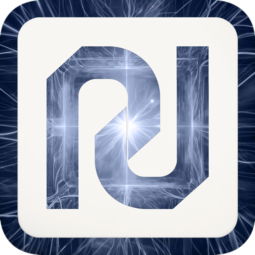
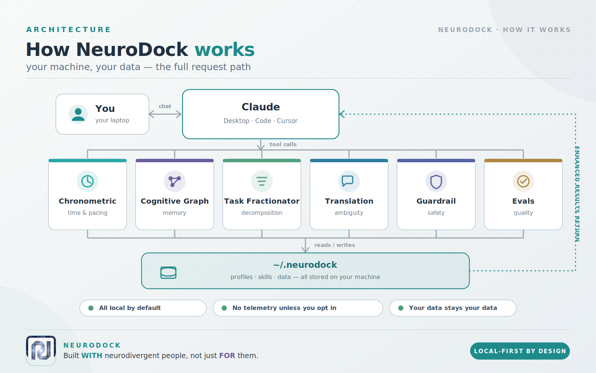
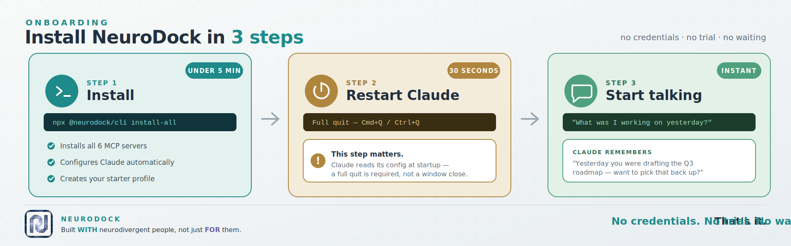
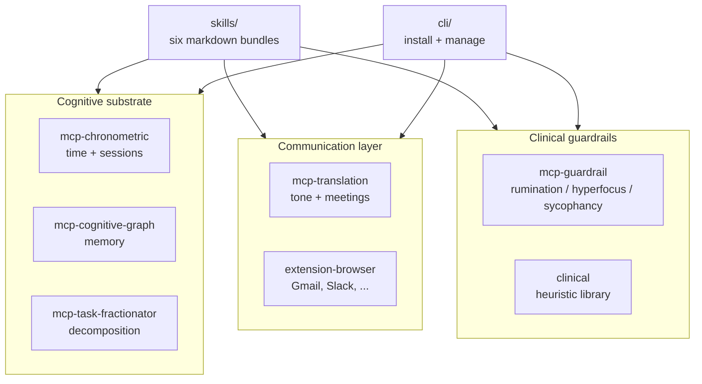

<p align="center">
  
</p>

<h1 align="center">NeuroDock</h1>

<p align="center"><em>A cognitive substrate that remembers, paces, and refuses. Built with neurodivergent professionals, not for them.</em></p>

<p align="center">
  <a href="./LICENSE"></a>
  
  
  <a href="https://www.npmjs.com/package/@neurodock/cli"></a>
  <a href="https://pypi.org/project/neurodock-mcp-chronometric/"></a>
</p>

<p align="center">
  
  
  
  
  
</p>

## 5-second TL;DR

- **What it does:** gives Claude a memory of your work, a sense of time, a refuse-rumination guardrail, and a translator for corporate ambiguity.
- **Who it's for:** neurodivergent people — self-ID only, no diagnosis required, no gatekeeping.
- **How to install:** one command, below.

NeuroDock plugs into Claude Desktop / Claude Code / Cursor (any MCP-aware
client). Local-first by default. No telemetry. AGPL-3.0-or-later.

## How it fits together

You chat with Claude exactly like normal. Under the hood, Claude calls
NeuroDock's local MCP servers; they read and write your local store; the
result flows back into Claude's reply.

<p align="center">
  
</p>

Everything runs on your laptop. Nothing leaves your machine unless you
explicitly turn on a cloud option.

<p align="center">
  
</p>

## Install

```sh
npx --yes @neurodock/cli@latest install-all
```

One command. It pip-installs the five MCP servers (plus the `neurodock-evals`
harness), wires Claude Desktop / Claude Code / Cursor, and drops a starter
profile at `~/.neurodock/profile.yaml`.

Then, **in any conversation**, try one of:

```
What was I working on yesterday?
Plan my morning.
Decompose this goal into atomic tasks.
```

Claude calls the MCP tools under the hood; you just talk.

> ### 🛑 First-time gotcha: full-quit Claude before testing
>
> Claude only reads its MCP config at startup. **Closing the window is not
> enough.** This is the #1 silent failure people hit.
>
> - **macOS:** `Cmd + Q` (or Claude menu → Quit Claude).
> - **Windows:** right-click the Claude icon in the system tray → **Quit**.
> - **Linux:** kill the process (`pkill -f Claude` or quit from the tray).
>
> Then reopen Claude and try one of the prompts above.

Requires Python 3.11+ and Node 22+. Works on macOS, Linux, Windows.

> **Why `@latest`?** If you previously ran `npm install -g @neurodock/cli`,
> npx will silently reuse that older global install instead of fetching the
> current version — and old versions don't have `install-all`. The `@latest`
> tag forces npx to resolve against the npm registry every time. Same reason
> we use it on `update`.

<details>
<summary><strong>Want to install it step-by-step instead?</strong></summary>

NeuroDock ships across two registries: the Python **MCP servers** (MCP =
Model Context Protocol — the standard that lets Claude call local tools)
on PyPI, and the user-facing **CLI** on npm. The CLI wraps everything else.

**1. Install the six MCP servers**

```sh
pip install neurodock-mcp-chronometric neurodock-mcp-cognitive-graph neurodock-mcp-task-fractionator neurodock-mcp-translation neurodock-mcp-guardrail neurodock-evals
```

**2. Wire them into your MCP-aware client**

```sh
npx --yes @neurodock/cli@latest init
```

Detects Claude Desktop, Claude Code, or Cursor and writes the server
entries automatically.

**3. Restart Claude** (full quit, not close-window — see the callout above).

**About the `neurodock` command** — it lives on npm as `@neurodock/cli`,
**not** on PyPI. The `pip install` step gives you the MCP server binaries
that Claude calls over stdio; the CLI is separate. Two ways to run it:

```sh
# Option A — run via npx, no install
npx --yes @neurodock/cli@latest doctor

# Option B — install once, call 'neurodock' from anywhere
npm install -g @neurodock/cli
neurodock doctor
```

`@neurodock/cli` exposes: `init`, `doctor`, `validate`, `update`, `sync`,
`uninstall`, `host install`, `host uninstall`, `profile show`,
`profile validate`, `install-all`, `install-hooks`, `examples`,
`plugin add/remove/list/enable/disable/validate`.

### Proactive guardrails (optional, recommended)

By default NeuroDock waits for you to ask. That's the wrong shape — an
ND user in hyperfocus is the one least likely to remember to run a
break tool. One command flips it:

```sh
neurodock install-hooks --self-test
```

This wires a small Python script (bundled, stdlib-only — no extra
install needed) into Claude Code's hook system. It then runs silently
on every tool call and auto-fires the chronometric / rumination /
sycophancy heuristics when patterns trip. You get a one-line stderr
banner on the next prompt — never blocked, always dismissible.

For host-agnostic coverage (catches you working in the terminal at
02:00 too), add the standalone daemon:

```sh
neurodock install-hooks --install-daemon --self-test
```

That registers a per-user autostart entry (HKCU Run on Windows,
LaunchAgent on macOS, systemd `--user` on Linux). The daemon polls
every 5 min and surfaces OS-native notifications.

Opt out anytime:

```sh
neurodock install-hooks --uninstall          # removes both
export NEURODOCK_GUARDRAILS=off              # disables without removing
```

The browser extension carries its own equivalent (Phase 2 watchdog) —
it's enabled by default and toggleable from `chrome.storage.local` via
the popup Settings tab.

See [`docs/.../proactive-guardrails`](./docs/src/content/docs/concepts/proactive-guardrails.mdx) for the design behind this and the
opt-out matrix.

Want to see it work without installing from PyPI/npm at all?
`TESTING_LOCAL.md` walks through the from-clone path.

</details>

<details>
<summary><strong>Prefer a plugin, a one-click desktop extension, or the MCP Registry?</strong></summary>

The `install-all` command above is the recommended path. The same servers are
also distributed through three standard channels — all install the identical
local stdio servers, so you can pick whichever fits your client:

**Claude Code plugin** — bundles the five MCP servers _and_ a set of ND-aware
skills in one step. Requires [`uv`](https://docs.astral.sh/uv/) (the servers
run via `uvx`).

```
/plugin marketplace add tlennon-ie/neurodock
/plugin install neurodock@neurodock
```

**Claude Desktop extension (`.mcpb`)** — one-click install, no config editing.
One bundle per server under [`mcpb/`](./mcpb/); build with
`npx @anthropic-ai/mcpb pack mcpb/neurodock-mcp-translation` and drag the
`.mcpb` onto Claude Desktop → Settings → Extensions. Requires `uv`.

**Official MCP Registry** — each server ships a
[`server.json`](./packages/mcp-translation/server.json) and is published to
[registry.modelcontextprotocol.io](https://registry.modelcontextprotocol.io)
under the `io.github.tlennon-ie/*` namespace, so MCP-aware clients can discover
them directly.

**Hosted remote server (no install)** — the stateless tools (translation,
guardrail, and `decompose`) are also served over OAuth at a hosted HTTPS
endpoint, so you can use them with no local install and no `uv`:

```
https://mcp.neurodock.org/mcp
```

In Claude (claude.ai or Desktop) → **Settings → Connectors → Add custom
connector** → paste that URL → complete the sign-in prompt. The eight stateless
tools appear immediately. An opt-in memory surface (`enable_hosted_storage`,
`connect_byos_storage`, `record_fact`, `recall_entity`, …) is also exposed but
does nothing until you explicitly enable storage for your signed-in account. The
personal cognitive graph and neurotype profile are **never** hosted — they stay
on the local install. Full walkthrough: [Hosted server](./docs/src/content/docs/getting-started/remote.mdx).

The hosted remote server is live at `mcp.neurodock.org`.

</details>

## Update

```sh
npx --yes @neurodock/cli@latest update
```

One command. Upgrades all six MCP servers (`pip install --upgrade` /
`uv tool install`), refreshes your wired client configs, and
re-registers the optional native-messaging host. Same flags as
`install-all` (`--client`, `--profile`, `--installer`, `--dry-run`,
`--no-native-host`, `--yes`).

The browser extension auto-updates through the Chrome / Firefox / Edge
store; sideloaded users `git pull` and rebuild.

> Full-quit Claude after updating so it re-reads its MCP config — same
> as first install.

Just want to re-shape client configs without touching package versions?
Use `neurodock sync`.

## See it in action

**The cognitive substrate in a real session** — you talk to Claude normally;
under the hood it calls NeuroDock's MCP tools to remember, pace, and decompose.

https://github.com/user-attachments/assets/bcbf65ce-88dd-4f83-8dc1-d56bdde01bed

**The browser extension** — translating corporate-speak inline on Gmail, Slack,
and the rest, right where you read it, without context-switching back to Claude.

https://github.com/user-attachments/assets/5fa25044-923e-4c25-95bd-f1bd63fb3d6e

> Prefer a written walkthrough? Try the [Claude Desktop walkthrough](./examples/claude-desktop/README.md).

## Browser extension (optional)

There's also a browser extension that translates corporate-speak inline on
Gmail, Slack, Linear, Notion, GitHub, Google Docs, and Outlook. It calls
the same translation tools the MCP server exposes, but surfaces them
where you'd actually use them — a floating Translate button plus a
right-click menu — so you don't have to context-switch back to Claude
just to decode "let's circle back on this."

You pick the LLM provider. Five options: Ollama (local, default), LM
Studio (local), OpenRouter (including its auto-router), Anthropic, OpenAI.
The API key, if you need one, stays in `chrome.storage.local` and never
leaves the device.

Store submission is still pending (the listing prep is done; the developer
accounts and screenshots aren't). Until then, load it manually:

1. Build it: `pnpm --filter @neurodock/extension-browser run build`
2. Chrome / Edge: go to `chrome://extensions`, turn Developer mode on,
   click **Load unpacked**, and pick `packages/extension-browser/.output/chrome-mv3/`.
3. Firefox: go to `about:debugging`, click **This Firefox** → **Load
   Temporary Add-on**, and pick `manifest.json` inside
   `packages/extension-browser/.output/firefox-mv3/`.

Full per-provider setup walkthrough lives in
[`packages/extension-browser/README.md`](./packages/extension-browser/README.md).

## What's inside

NeuroDock is built around three pillars. Each pillar is made of small,
independent packages that you can use one at a time or all together.



<details>
<summary>Prefer the directory tree? Open this.</summary>

```
neurodock/
├── packages/
│ ├── mcp-chronometric/      Time + session + break management
│ ├── mcp-cognitive-graph/   Persistent memory + entity recall (SQLite)
│ ├── mcp-task-fractionator/ Decompose vague goals into atomic tasks
│ ├── mcp-translation/       Corporate-speak translator (MCP + browser ext)
│ ├── mcp-guardrail/         Rumination / hyperfocus / sycophancy detectors
│ ├── skills/                Six SKILL.md bundles activating on phrases
│ ├── extension-browser/     WXT-built Chrome / Firefox / Edge extension
│ ├── native-host/           Optional native messaging host (extension <-> profile.yaml)
│ ├── cli/                   `npx neurodock init` and friends
│ ├── core/                  Shared types, profile schema, plugin spec
│ ├── clinical/              Heuristic library for the guardrail server
│ └── evals/                 Eval harness + corpus contribution pipeline
├── docs/                    Astro Starlight site (deploys to docs.neurodock.org)
├── plugins/                 Drop your own plugins here; auto-discovered
└── profiles/                Curated profile presets
```

</details>

## Status

**Public preview shipped.** All three substrate pillars (cognitive,
communication, guardrails) are built, on `main`, and installable from
npm + PyPI. Latest substrate tag: `v0.7.3`.

### MCP servers (PyPI)

- **`neurodock-mcp-chronometric`** — 5 tools, 22 tests, mypy `--strict`.
- **`neurodock-mcp-cognitive-graph`** — 4 tools, SQLite + sqlite-vec
  - fastembed; 4-rung resolution cascade (exact → alias → fuzzy → embedding).
    Latest patch ships friendlier `record_fact` errors so wrong-shape input
    no longer leaks raw Pydantic traces.
- **`neurodock-mcp-task-fractionator`** — 2 tools, 32 tests; ISO 8601
  duration spec.
- **`neurodock-mcp-translation`** — 4 tools, 29 tests; deterministic
  baseline plus LLM refinement envelope.
- **`neurodock-mcp-guardrail`** — all three detectors live: rumination,
  hyperfocus, sycophancy (48 tests, public heuristics).
- **`neurodock-evals`** — air-gapped harness, 10 seed corpus examples,
  contribution pipeline.
- **`neurodock-clinical`** — reserved name; importable detector library
  (currently a stub).

### CLI + browser surface (npm)

- **`@neurodock/cli`** — 19 verbs across 7 groups: `init`, `install-all`,
  `examples`, `doctor`, `validate`, `update`, `sync`, `uninstall`,
  `host install/uninstall`, `profile show/validate`, `install-hooks`,
  `plugin add/remove/list/enable/disable/validate`. `install-hooks`
  wires the proactive-guardrail hook into Claude Code and optionally
  registers the standalone daemon.
- **`@neurodock/core`** — profile schema and plugin protocol manifests
  (JSON Schema 2020-12).
- **`@neurodock/native-host`** — optional Chrome Native Messaging host
  for the extension ↔ profile sync.
- **`@neurodock/extension-browser`** — WXT MV3 build for Chrome / Firefox
  / Edge. Seven sites wired. Five real LLM providers: Ollama, LM Studio,
  Anthropic, OpenAI, OpenRouter. Includes the Phase 2 proactive watchdog
  for hyperfocus / late-night / single-host rumination signals.
  **Not yet store-published.**

### Skills + docs

- **Six launch skills** — `adhd-daily-planner`, `audhd-context-recovery`,
  `ocd-decision-finalizer` (beta), `hyperfocus-formatter`, `visual-organizer`,
  `asd-meeting-translator`.
- **Docs site** — builds clean (Astro Starlight), deploys to
  [`docs.neurodock.org`](https://docs.neurodock.org).

### Still deferred

- **Browser-store submissions** — Chrome Web Store, Firefox Add-ons, Edge
  Add-ons developer accounts + screenshots; manual step.

## How to actually test it right now

**`TESTING_LOCAL.md`** — step-by-step guide to running this against your
Claude Desktop, today, from a clone. Takes about 5 minutes.

## Documentation

The docs site lives at [`docs.neurodock.org`](https://docs.neurodock.org).
Source is at `docs/src/content/docs/`. To preview locally:

```bash
pnpm --filter @neurodock/docs run dev
# opens http://localhost:4321
```

## Architecture

The substrate splits into three pillars:

1. **Cognitive substrate** — externalises executive function (time,
   memory, decomposition). MCP servers: chronometric, cognitive-graph,
   task-fractionator.
2. **Communication layer** — translates corporate ambiguity; rewrites
   outgoing messages for register-appropriate tone; structures meeting
   transcripts. MCP server: translation. Browser extension surfaces the
   same prompts in Gmail / Slack / Linear / Notion / GitHub / Docs / Outlook.
3. **Clinical guardrails** — detects and intervenes on rumination
   (repeat-validation loops), hyperfocus (escalating session-length
   nudges), and sycophancy (unconditional agreement). MCP server: guardrail.
   Heuristics are public and auditable per `ETHICS.md`.

All three layers compose via the same MCP protocol the LLM client already
speaks. There's no "NeuroDock app" — the surface is your Claude client.

Design rationale lives in `docs/decisions/`:

- ADR 0001 — chronometric tool design
- ADR 0002 — cognitive-graph tool design
- ADR 0003 — task-fractionator tool design
- ADR 0004 — profile schema
- ADR 0005 — translation tool design
- ADR 0006 — guardrail tool design
- ADR 0007 — plugin protocol
- ADR 0008 — distribution & remote strategy

## Contributing

`CONTRIBUTING.md` has the welcome + on-ramp. Pick whichever lane matches
what you want to do:

**Smallest first PR (~15 min):**

- Add a test to an existing skill (`packages/skills/<name>/tests/`)
- Add a seed eval example (`packages/evals/corpora/translation/`)
- Improve a tool's parameter description (the LLM uses these — clearer
  descriptions = better tool use)

**One-afternoon PR:**

- Write a new skill — markdown bundle activating on specific phrases.
  Copy any `packages/skills/<name>/` as a template; see
  `docs/src/content/docs/contribute/write-a-skill.mdx`.
- Sharpen the task-fractionator heuristics (regex / domain keyword maps).
- Add a new entity-resolution heuristic (e.g., phonetic) to
  `mcp-cognitive-graph`.

**Multi-day PR:**

- Build an out-of-tree plugin (skill / mcp-server / profile / translation
  pack / language pack / theme) per the ADR 0007 plugin protocol. See
  `docs/src/content/docs/contribute/write-a-plugin.mdx`.
- Translation language pack (e.g., Hiberno-English, German directness norms,
  Japanese keigo).

**No code:**

- Add an anonymised eval example from your own corporate inbox. The
  contribution pipeline lives in `packages/evals/` and is the highest-
  leverage non-code contribution.

All PRs run CI: `pnpm turbo run lint typecheck test build` + `uv run pytest`

- `uv run mypy --strict packages/...`. Every published package has its
  own CHANGELOG. Use Conventional Commits in PR titles (`feat:`, `fix:`,
  `docs:`, `test:`, `chore:`, `ci:`).

## Manifesto (short)

1. **Lower friction for users, and for contributors.**
2. **Local-first by default; cloud is opt-in.**
3. **The user is the authority.** Self-ID sufficient.
4. **Composable over monolithic.** No god-modules.
5. **Refuse where appropriate.** AI that fuels rumination, hyperfocus, or
   anxiety is a regression, not a feature.

Full text in `MANIFESTO.md`. Ethics framework in `ETHICS.md`. Governance
in `GOVERNANCE.md`.

## License

[AGPL-3.0-or-later](LICENSE). Plugins must declare an AGPL-compatible license
to load — the SPDX whitelist is in ADR 0007.
