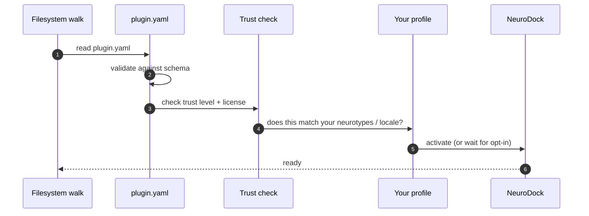

A plugin is how NeuroDock grows without forking. The substrate exposes six extension points — skills, MCP servers, profile presets, translation packs, language packs, themes — and every extension declares itself through a single `plugin.yaml` manifest. There is no plugin runtime, no compiler, no central server: a plugin is content the substrate reads, and the substrate composes it against the user's profile.

Pick the path that matches what you want to do right now. The rest of the page is the conceptual model; you only need it if you want it.

## I just want to install a plugin

You have a plugin (yours or someone else's) sitting in a directory. You want it active. Three commands:

```sh
neurodock plugin add <path-to-plugin-directory>
neurodock plugin enable <name>
neurodock plugin list
```

`plugin add` copies the plugin into `~/.neurodock/plugins/`. `plugin enable` writes a small marker file so the substrate activates it on next start. `plugin list` shows you what is installed and which entries are enabled. To remove or pause: `neurodock plugin remove <name>` or `neurodock plugin disable <name>`.

**Where pre-built plugins live.** The repository ships a `plugins/` directory with skill plugins (`example-skill-pomodoro`, `skill-civil-servant-briefing`, `skill-eng-manager-1on1`, `skill-lawyer-matter`, `skill-pm-stakeholder-juggle`, `skill-researcher-litreview`, `skill-software-engineer-daily`, `skill-writer-long-form`) and translation packs (`translation-customer-support`, `translation-german-directness`, `translation-healthcare`, `translation-hiberno-english`, `translation-japanese-keigo`, `translation-legal`, `translation-sales`). Point `plugin add` at any of those directories to install it.

See the [CLI reference](/reference/cli/) for every flag and exit code.

## I want to build a new plugin from scratch

Start with the contributor walkthrough — it shows you the minimum manifest, the directory layout, and the validation step before you commit anything.

- [Write a plugin](/contribute/write-a-plugin/) — the step-by-step walkthrough, including the six plugin types and the choice between in-tree and out-of-tree distribution.
- [Plugin manifest reference](/reference/plugin-manifest/) — every field in `plugin.yaml`, every default, every constraint.
- [ADR 0007](/decisions/0007-plugin-protocol/) — the design rationale, the trust ladder, and the decisions that bind every plugin author.

Validate your manifest before installing with `neurodock plugin validate <path>`.

---

The rest of this page covers the conceptual model behind plugins. Read it if you want to understand the trust ladder and profile composability; skip it if you just wanted the commands.

## How a plugin gets loaded

When NeuroDock starts, it walks every plugin directory it knows about, checks each one, and only then turns it on. The diagram below shows what happens for one plugin. If any step fails, the plugin is skipped (cleanly) and you see why.



## Why plugins exist as a distinct concept

The project's `packages/` directory holds the first-party substrate — the small set of MCP servers and skills the maintainer ships and reviews directly. That directory is intentionally narrow. If every contribution had to land in `packages/`, the project would either accumulate scope creep until the maintainer burned out, or it would reject contributions that did not fit the narrow first-party scope.

Plugins solve this by giving contributors a parallel surface area with looser ceremony. A plugin lives in `plugins/` (in-tree, with a fast PR path) or in `~/.neurodock/plugins/` (out-of-tree, with no project-side review). The substrate treats both identically at runtime. The difference is the social process around each path, not the technical contract.

## Plugin versus in-tree skill — the distinction

In-tree skills live in `packages/skills/<name>/` and ship with the project's release cadence. They do not need a `plugin.yaml`; they are part of the substrate's main artefact. They get the most rigorous review and the broadest reach.

Skill plugins live in `plugins/<name>/` or in `~/.neurodock/plugins/<name>/` and ship on their own cadence. They need a `plugin.yaml`. They get whatever review their distribution path implies — full project review for in-tree plugins, no project-side review for out-of-tree plugins.

The SKILL.md format is identical between the two. The choice is about process, not format.

## The trust ladder

Every plugin declares one of four trust levels. The levels are not a hierarchy of quality — they are a hierarchy of **how much social process has touched this plugin**.

| Level | Who can ship | Substrate behaviour |
|---|---|---|
| `community` | Anyone, by default. | Loads on explicit user opt-in; surfaces a "community plugin" notice on first activation. |
| `reviewed` | Plugins that have passed lived-experience review. | Loads on explicit opt-in; no first-activation notice. |
| `verified` | Plugins signed against the maintainer-curated keyring (planned — see [ROADMAP.md](https://github.com/tlennon-ie/neurodock/blob/main/ROADMAP.md)). | Loads on profile match; the signature is the consent. |
| `core` | First-party packages from this repository. | Loads on profile match; the substrate vouches for it. |

The substrate never silently elevates a plugin. Promotion requires a deliberate review step. There is no automatic promotion based on download count, usage, or time.

Signing infrastructure (the `verified` tier) is future work alongside the plugin marketplace — see [ROADMAP.md](https://github.com/tlennon-ie/neurodock/blob/main/ROADMAP.md) §Later. Until then, the `trust.signature` field is reserved in the manifest but unenforced.

## How profile composability decides auto-activation

The substrate composes three sources to decide which plugins activate for a given user:

1. **The user's profile** — `~/.neurodock/profile.yaml`. Declares neurotypes, preferences, privacy, guardrail thresholds.
2. **Each installed plugin's manifest** — declares `neurotypes`, `profile_dependencies`, and `mcp_dependencies`.
3. **The trust level of each plugin** — decides whether activation is automatic, opt-in with notice, or opt-in without notice.

A plugin tagged `neurotypes: ["adhd"]` does not activate for a user whose profile declares `neurotypes: ["asd"]` — even if the plugin is installed. Self-identification gates activation. Diagnosis is never required.

A plugin that depends on a profile field set to a value the plugin cannot honour (e.g. a plugin that needs cloud embeddings on a user with `privacy.embeddings: local`) does not auto-activate; the substrate surfaces an explicit consent prompt instead. The user always has the final say.

## The six plugin types

| Type | Extends |
|---|---|
| `skill` | The skill library. Out-of-tree skills, same format as in-tree. |
| `mcp-server` | The substrate. New typed tools that any client and skill can call. |
| `profile` | Curated profile presets, composed via the user's `extends:` field. |
| `translation-pack` | Domain and relationship prompts for `mcp-translation`. |
| `language-pack` | Cultural-register prompts for non-US-English corporate cultures. |
| `theme` | Design tokens and CSS for UI surfaces, accessibility-audited. |

See [Write a plugin: the six plugin types](/contribute/write-a-plugin/#the-six-plugin-types) for picking guidance.

## The federated registry (planned)

A plugin marketplace and federated registry are tracked on [ROADMAP.md](https://github.com/tlennon-ie/neurodock/blob/main/ROADMAP.md) §Later. The registry would index plugin manifests for discovery and let users install plugins with a single command. Signed plugins would surface verified-tier badges; unsigned plugins would surface `community` tier notices.

The registry is intentionally federated. The protocol for a plugin registry is open; anyone can run a fork; the maintainer operates the canonical one. This is the same federation principle that applies to the eval corpus (`packages/evals/`) and the language packs: no single index can become a chokepoint for what counts as a legitimate plugin.

We will not promise specific dates for the registry. We will document the onboarding when it lands.

## What's next

- [Write a plugin](/contribute/write-a-plugin/) for the contributor walkthrough.
- [Plugin manifest reference](/reference/plugin-manifest/) for the field-by-field schema.
- [Concepts: profiles](/concepts/profiles/) for the manifest plugins compose against.
- [Concepts: substrate](/concepts/substrate/) for the layer plugins extend.
