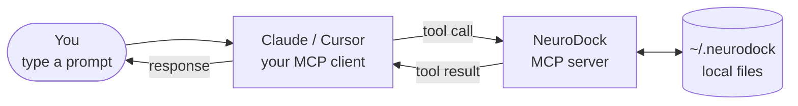
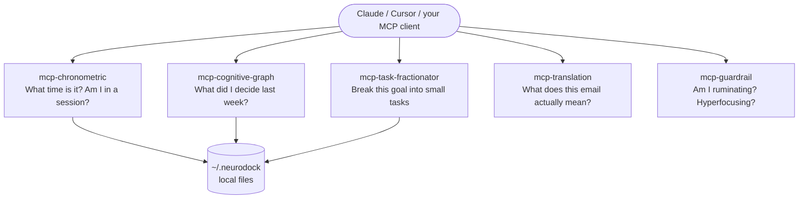

## Mental model

What actually happens when you type something into Claude. Your input goes through the LLM, which decides whether to call a substrate tool; the tool reads or writes local files; the answer comes back.

:::tip[Analogy]
Think of the substrate as the physical hardware shelves in your closet; it doesn't care what clothes you put on them, it just keeps them off the floor.
:::

The substrate is the layer of MCP servers and skills that externalise executive function — time awareness, persistent memory, task decomposition, communication translation, and clinical safety. Five MCP servers shipped in `v0.2.1` and are installable from PyPI. Each is small, single-purpose, and independently versioned.

## How the five servers relate

Each server does one thing. They don't import each other — they communicate by passing plain data through your MCP client. The diagram shows what each one is responsible for and how a skill might use them together.

## What an MCP server is

The Model Context Protocol (MCP) is a standard for connecting language models to external tools and data. An MCP server exposes a set of named **tools** with typed inputs and outputs. Any MCP-aware client (Claude Desktop, Claude Code, Cursor, others) can call those tools at the model's request.

NeuroDock's substrate is a set of MCP servers, not a wrapper around any one model vendor. The user's MCP client is the LLM boundary; the substrate never embeds a model call.

## Why MCP

- **Vendor-neutral.** The same servers work in any MCP-aware client. Switching models does not break your substrate.
- **Auditable.** Tool calls are visible in the client. Every nudge, every recall, every decomposition is inspectable.
- **Composable.** Skills compose tool calls; tools compose into skills. Nothing is a monolith.

## The five substrate servers

| Server | Tools | Job |
|---|---|---|
| [`mcp-chronometric`](/reference/mcp-servers/chronometric/) | `get_time_context`, `mark_session_start`, `mark_session_end`, `request_break_if_needed`, `idle_status` | Externalise time and session awareness. |
| [`mcp-cognitive-graph`](/reference/mcp-servers/cognitive-graph/) | `recall_entity`, `record_fact`, `recall_decisions`, `weekly_rollup` | Externalise memory: people, projects, decisions, concepts. |
| [`mcp-task-fractionator`](/reference/mcp-servers/task-fractionator/) | `decompose`, `next_one` | Externalise decomposition: vague goal in, atomic tasks out. |
| [`mcp-translation`](/reference/mcp-servers/translation/) | `translate_incoming`, `check_tone`, `rewrite_outgoing`, `brief_meeting` | Translate corporate-communication ambiguity and structure meeting transcripts. |
| [`mcp-guardrail`](/reference/mcp-servers/guardrail/) | `check_rumination`, `check_hyperfocus`, `check_sycophancy` | Clinical-safety detectors. Stateless, override-first. |

Each tool's input and output schema lives at `packages/<server>/schemas/*.schema.json` and is the source of truth.

## Design rules that bind every substrate server

These are inherited from [ADR 0001](/decisions/0001-chronometric/) and adopted by every subsequent server:

- **Small tools, single responsibility.** Each tool does one job. No god-tool.
- **Server-side state, not LLM-maintained state.** The model never has to remember a `session_id` or a `fact_id`.
- **Local-first.** No remote calls. Profile and storage live on the user's machine.
- **Enums for coarse signals, not floats.** `energy_zone`, `resolution.method`, error codes — all enums.
- **`null` is a first-class return.** Tools return `null` for "no match"; callers MUST handle it.
- **Additive-only within a `v0.1.x` line.** Renames and removals require a new major version with a parallel schema `$id`.

See the [decisions index](/decisions/) for the full set of design ADRs.

## What is NOT in the substrate

- **No LLM call from inside a substrate server.** The user's MCP client is the only LLM boundary. The cognitive graph's `weekly_rollup` and the fractionator's decomposition both use local heuristics. LLM-assisted variants are an envelope on the caller side — see `mcp-translation` `v0.0.1` for the deterministic-plus-LLM-envelope pattern.
- **No remote storage.** SQLite + `sqlite-vec` lives at `~/.neurodock/store.sqlite`. SQLCipher is the opt-in at-rest encryption layer.
- **No telemetry.** The substrate has no remote endpoint to send to.

## What's next

- [Skills](/concepts/skills/) — how user-facing workflows compose substrate tools.
- [Profiles](/concepts/profiles/) — the consent and preference manifest every server reads.
- [Guardrails](/concepts/guardrails/) — the clinical safety layer. `mcp-guardrail` `v0.0.3` ships all three detectors live; profile-level hooks under `guardrails` configure them.
