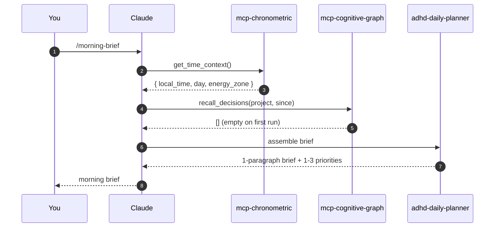

After this page you will have run one NeuroDock skill end-to-end and seen the substrate work as a chain: chronometric → cognitive-graph → `adhd-daily-planner`.

<figcaption style="font-size: 0.85rem; color: var(--sl-color-gray-3); margin-top: -0.75rem; margin-bottom: 1.5rem;">
  What `/morning-brief` does under the hood. A short screen-capture demo is tracked in <a href="https://github.com/tlennon-ie/neurodock/issues/27">issue #27</a>.
</figcaption>

:::tip[Where the skill comes from]
You do not install `adhd-daily-planner` by hand. The per-neurotype skills are copied into `~/.claude/skills` automatically by `neurodock install-all` or `neurodock setup`. To (re)install them on demand, run `neurodock install-skills`. If you use the Claude Code marketplace plugin, the skills ship bundled with it.
:::

## Prerequisites

- [Installation](/getting-started/installation/) is complete and `neurodock doctor` passes.
- Claude Desktop is restarted (full quit, not close-window) and you can see the five NeuroDock MCP servers in its tool list.

## Run it

Open Claude Desktop, start a new chat, and type `/morning-brief`. That's it.

You should see:

- A tool call to `get_time_context()` from `mcp-chronometric` returning the current time, your energy zone, and how long since your last prompt.
- A tool call to `recall_decisions(project: ..., since: ...)` from `mcp-cognitive-graph` returning any decisions made overnight (empty on a fresh install).
- A one-paragraph brief plus 1–3 things that matter today, assembled by the `adhd-daily-planner` skill.

## Expect the first run to be sparse

On a fresh install the cognitive graph is empty, and the brief will say so plainly — something like:

> The cognitive graph has no decisions or open blockers recorded yet. That is expected on a fresh install. Today's brief is just the time context: morning peak, Friday, no open session.

This is correct behaviour. The substrate does not fabricate context it does not have. As you use NeuroDock — recording decisions, naming projects, closing sessions — the brief gets richer.

## What happened

The skill called two MCP tools (no LLM call inside the substrate) and assembled the result. None of this leaves your machine: the profile, the graph, the session state — all local.

## What's next

- [Edit your profile](/getting-started/profile/) so the substrate matches your rhythms.
- Look at the `adhd-daily-planner` source in `packages/skills/adhd-daily-planner/SKILL.md` to see exactly what the skill does. Skills are markdown bundles, not opaque code.
- Try `/resume` (the [`audhd-context-recovery`](/reference/skills/audhd-context-recovery/) skill) for the inverse experience: yesterday's mental state, reconstructed from the graph.
