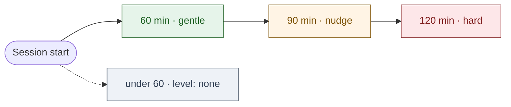

## Tools at a glance

| Tool | What it takes | What it returns | Why your brain cares |
|---|---|---|---|
| `get_time_context` | nothing | local time, day, session length, `energy_zone` band | removes the executive-function tax of estimating how long you've been hyperfocused — the server tells you, you don't have to guess |
| `mark_session_start` | `{ intent: string }` | `session_id`, `started_at`, optional auto-closed prior | makes your intent durable across the model's amnesia so a 3-hour session doesn't drift from "draft the migration plan" into "tune the regex" |
| `mark_session_end` | optional `summary` | `session_id`, `ended_at`, ISO 8601 duration | closes the loop honestly; lets you see the real elapsed time instead of the time-blind estimate your brain produced |
| `request_break_if_needed` | `{ threshold_minutes }` | `null` OR `{ elapsed, prior_intent, suggested_action }` | a structured "you've been at this 90 minutes, you said 30" — quoted back in your own words, not a productivity lecture |
| `idle_status` | nothing | `{ consent_granted, os_idle_duration?, hyperfocus_signal }` | distinguishes "hyperfocused on another window" from "actually stepped away" so a nudge fires only when it's useful |

## Escalation ladder

The hyperfocus check escalates across three rungs of elapsed session time. Defaults are 60 / 90 / 120 minutes; the profile can rebalance them.

When `end_of_day_local` is set, the same elapsed times after that clock-time read one rung harder (gentle becomes nudge; nudge becomes hard). That is the `+30` and `+60` collapse described in ADR 0001.

## Server card

`mcp-chronometric` externalises time and session awareness so the LLM does not have to maintain that state across turns. It is the first substrate server and the precedent-setting design for every later substrate server.

- **Package:** `packages/mcp-chronometric/`
- **Version:** `0.0.2`
- **Schemas:** `packages/mcp-chronometric/schemas/*.schema.json`
- **ADR:** [0001 — Chronometric tool design](/decisions/0001-chronometric/)
- **Schema `$id` prefix:** `https://schemas.neurodock.org/mcp-chronometric/v0.1.0/`

## Tools (detailed contract)

| Tool | Input | Output |
|---|---|---|
| `get_time_context` | _none_ | `{ now, day_of_week, time_since_last_prompt, current_session_length, energy_zone }` |
| `mark_session_start` | `{ intent: string }` | `{ session_id, started_at, auto_closed_prior_session? }` |
| `mark_session_end` | `{ summary?: string }` | `{ session_id, ended_at, duration }` |
| `request_break_if_needed` | `{ threshold_minutes: integer }` | `null` OR `{ elapsed, prior_intent, suggested_action }` |
| `idle_status` | _none_ | `{ consent_granted, os_idle_duration?, hyperfocus_signal }` |

### `get_time_context`

Returns the current time context: wall-clock time, day of week, duration since the last prompt this server saw, length of the current open session, and a heuristic `energy_zone` bucket.

- `now` — ISO 8601 with explicit timezone offset. Never naive.
- `energy_zone` — enum: `morning_peak | midday | afternoon_dip | evening_quiet | night_owl_caution | unknown`. Computation is documented in ADR 0001.
- Pure read. No side effects. Safe to call freely.

### `mark_session_start`

Anchors a unit of work with a stated intent. Returns a `session_id` (UUIDv4) and the start time. The intent string is preserved verbatim — skills like the hyperfocus nudge quote it back to the user.

If a prior session is still open, the server auto-closes it (configurable via `chronometric.session_overlap_policy` in the profile) and reports the auto-closed metadata in `auto_closed_prior_session`.

### `mark_session_end`

Closes the most recent open session. Takes an optional `summary`. Returns the session id, end time, and ISO 8601 duration.

The tool deliberately takes **no `session_id` input** — that would force the LLM to maintain state. The server tracks the active session.

### `request_break_if_needed`

Caller passes `threshold_minutes`. Returns `null` when no break is warranted, or a structured payload containing the elapsed time, the user's verbatim prior intent, and a `suggested_action` enum.

`null` is a first-class return; callers MUST handle it.

### `idle_status`

Reads OS idle time, **consent-gated**. Without `privacy.os_idle_consent: true` in the profile, the tool returns a successful result with `consent_granted: false` and `hyperfocus_signal: "unknown"` — never an exception. Consent failures are not errors.

The `hyperfocus_signal` enum distinguishes hyperfocus-elsewhere (idle in this client but active on the system) from distraction-or-break (idle everywhere).

## Error codes

| Code | Meaning |
|---|---|
| `INTERNAL_CLOCK_UNAVAILABLE` | Server could not read system clock or timezone. Surfaced explicitly; never silent default. |
| `PROFILE_UNREADABLE` | Profile YAML present but unparseable. `energy_zone` falls back to `unknown` when possible rather than failing the whole call. |
| `SESSION_ALREADY_OPEN` | (Optional) `mark_session_start` called while a prior session is open and the profile says `error` instead of `auto_close`. |
| `NO_OPEN_SESSION` | `mark_session_end` called when no session is open. |
| `INVALID_THRESHOLD` | `request_break_if_needed` received a non-positive `threshold_minutes`. |
| `CONSENT_REQUIRED` | (Reserved) Future use only — `idle_status` does **not** raise this; it returns `consent_granted: false` instead. |

## Privacy

- Reads local profile and local session state only.
- No remote calls.
- The `intent` string passed to `mark_session_start` is treated as private user data. It is stored in the local session row and never logged in error payloads or telemetry.

## Versioning

- Additive-only within the `v0.1.x` line.
- Any rename, retype, removed enum value, or required-input addition is a major bump and ships under a new `$id` path (`/v1.0.0/...`).

## What's next

- [ADR 0001](/decisions/0001-chronometric/) for the full design rationale.
- [`mcp-cognitive-graph`](/reference/mcp-servers/cognitive-graph/) — the persistence backbone the time context feeds into.
