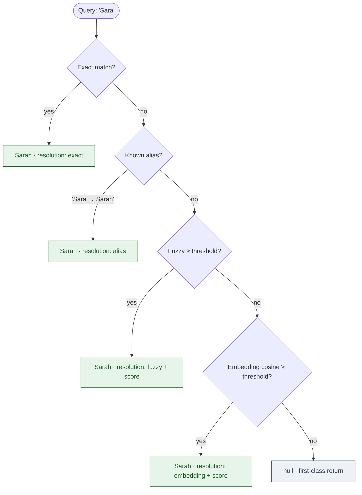

## Tools at a glance

| Tool | What it takes | What it returns | Why your brain cares |
|---|---|---|---|
| `recall_entity` | a name or alias (typo-tolerant) | the entity, related facts, and how it was matched | you typed "Sara" but the project lead is "Sarah" — the graph still finds her, and tells you it used an alias so you don't second-guess it |
| `record_fact` | `{ subject, predicate, object }` | canonical `fact_id`, dedup flag, auto-created entities | offloads the working-memory job of holding "I told Mark Tuesday" so your prefrontal cortex isn't a sticky note |
| `recall_decisions` | `{ project, since? }` | recent decisions, newest first | answers "what did we actually agree last Thursday" without forcing you to scroll three chat clients |
| `weekly_rollup` | `{ project? }` | seven-day snapshot: decisions, blockers, next actions | the Monday-morning catch-up your brain doesn't have to assemble from scratch — built from the facts already in the graph |

## Alias resolution cascade

A name lookup falls through four rungs until something matches. The output records which rung answered, so a downstream skill can say "I think you meant Sarah" instead of silently swapping the name.

`null` is a first-class return. Skills MUST handle it; the server never hallucinates a closest-match.

## Server card

`mcp-cognitive-graph` is the persistence backbone of the substrate. It externalises the user's working memory of people, projects, decisions, and concepts into a typed-edge property graph queried by name rather than by structured key.

- **Package:** `packages/mcp-cognitive-graph/`
- **Version:** `0.0.3`
- **Schemas:** `packages/mcp-cognitive-graph/schemas/*.schema.json`
- **ADR:** [0002 — Cognitive graph tool design](/decisions/0002-cognitive-graph/)
- **Schema `$id` prefix:** `https://schemas.neurodock.org/mcp-cognitive-graph/v0.1.0/`

## Tools (detailed contract)

| Tool | Input | Output |
|---|---|---|
| `recall_entity` | `{ name_or_alias: string }` | `{ entity \| null, facts, related_entities, resolution, truncated_facts }` |
| `record_fact` | `{ subject, predicate, object, source?, confidence? }` | `{ fact_id, recorded_at, subject, predicate, object, deduplicated, auto_created_entities? }` |
| `recall_decisions` | `{ project: string, since?: date }` | `Decision[]` (capped at 200, with `truncated`) |
| `weekly_rollup` | `{ project?: string }` | `{ project, period, summary, decisions, blockers, next_actions, generated_at }` |

### `recall_entity`

Forgiving on input: a user typing `"kipi"` retrieves `""`. Resolution falls through `exact → alias → fuzzy → embedding`. The output carries a `resolution.method` and `resolution.score` so skills can say "I think you meant X" when the method is `fuzzy` or `embedding`.

`null` is a first-class return when no alias-match crosses the threshold. Skills MUST handle it.

### `record_fact`

A fact is `{ subject, predicate, object, source?, confidence? }`.

- `subject` is `{ type, id | name }`. Either is sufficient; `(type, name)` upserts.
- `predicate` is from the v0.1.0 controlled vocabulary: `mentioned_in | decided_in | reports_to | depends_on | resolved_by | blocked_by | tagged | belongs_to`. New predicates are a major bump.
- `object` is either an entity reference or `{ literal: string }` for tags, statuses, or short notes.
- `source` is optional free-text (URL, message id, transcript citation). **Stored verbatim, never fetched.**
- `confidence` defaults to `1.0`. Inferred facts should lower it.

Returns the canonical `fact_id`, a `deduplicated` flag, and any `auto_created_entities` produced as a side effect.

### `recall_decisions`

Returns the project's decisions, ordered by `decided_on` descending. `since` is an ISO 8601 calendar date (date-only — the question "what did we decide this week" is intrinsically local-day, not instant-of-time). Capped at 200 with a `truncated` flag.

A "decision" is either a fact whose `predicate == "decided_in"` OR an entity whose `type == "decision"`. The server unions both.

### `weekly_rollup`

Returns a structured snapshot of the past seven days for a project: decisions, blockers, templated `next_actions`, plus a locally-templated `summary` (no LLM call inside the server).

A planned enhancement (see [ROADMAP.md](https://github.com/tlennon-ie/neurodock/blob/main/ROADMAP.md) §Next) is a `narrative` field populated by a caller-side LLM round trip; the local-template `summary` remains the always-available fallback.

## Entity types (v0.1.0)

Closed enum: `person | project | decision | concept | source`. New types ship in v0.2 via the `type_extensions` mechanism, not by mutating this enum.

## Error codes

| Code | Meaning |
|---|---|
| `SUBJECT_REQUIRED` | `record_fact` missing subject `{type}` plus at least one of `{id, name}`. |
| `OBJECT_REQUIRED` | `record_fact` missing object — needs at least one of `{id, name, literal}`. |
| `PREDICATE_UNKNOWN` | Predicate not in the v0.1.0 vocabulary. |
| `ENTITY_TYPE_UNKNOWN` | Entity type not in the v0.1.0 taxonomy. |
| `CONFIDENCE_OUT_OF_RANGE` | Confidence not in `[0, 1]`. |
| `GRAPH_WRITE_FAILED` | Local SQLite store rejected the write. May retry once. |

## Privacy

- All reads and writes hit the local SQLite + `sqlite-vec` store only.
- No remote calls. No telemetry. No implicit fetch of stored `source` URLs.
- The graph's contents are sensitive (decision titles, blocker text, entity names reveal goals and frustrations). They are stored locally and treated as user-private.
- SQLCipher is the opt-in at-rest encryption layer via the profile.

## Versioning

- Additive-only within `v0.1.x`.
- New predicates and entity types ship via the v0.2 `type_extensions` mechanism, not by mutating this schema.

## What's next

- [ADR 0002](/decisions/0002-cognitive-graph/) for design rationale, including why vector search is **not** a separate tool in v0.1.
- [`mcp-task-fractionator`](/reference/mcp-servers/task-fractionator/) — pairs with the cognitive graph for persisting decompositions.
