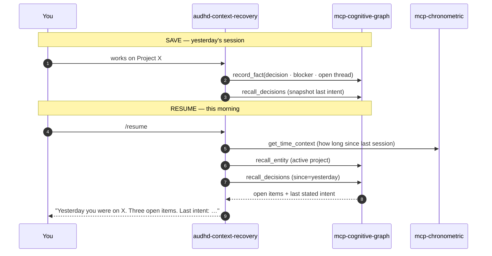

:::tip[How to invoke this skill]
Any of these triggers a context recovery:

- `/resume`
- `/where-was-i`
- "where was I"
- "what was I working on"
:::

> Source: `packages/skills/audhd-context-recovery/SKILL.md` is the canonical artefact. Frontmatter and triggers may change before v0.1.

Think of this skill as the **Save / Resume State** snapshot for a working context. Yesterday's session saved facts and decisions into the cognitive graph. Today, `/resume` reads them back so you can pick up the thread without rebuilding it from scratch.

A skill that reconstructs yesterday's (or last-Friday's) mental state from the cognitive graph: open decisions, blockers, recent facts, the last stated session intent. Designed for AuDHD users returning to work after context loss.

## Frontmatter summary

| Field | Value |
|---|---|
| `name` | `audhd-context-recovery` |
| `version` | `0.1.0` |
| `status` | `stable` |
| `neurotypes` | `["audhd", "asd", "adhd"]` |

## Triggers

- Slash command: `/resume`.
- Semantic match against phrases like *"where was I"*, *"pick up from yesterday"*.

## MCP dependencies

- [`mcp-cognitive-graph`](/reference/mcp-servers/cognitive-graph/) — `recall_decisions`, `weekly_rollup`, `recall_entity`.
- [`mcp-chronometric`](/reference/mcp-servers/chronometric/) — `get_time_context()` for the "how long since you last worked here" anchor.

## Profile dependencies

- `preferences.output_format` — answer-first vs conventional.
- `preferences.max_chunk_size` — caps the number of open items surfaced.

## Acceptance (from )

> `/resume monday` runs in ≤ 5s against a 30-day graph; brief names projects, decisions, one action with confidence > 0.7.

## What's next

- [Run your first skill](/getting-started/first-skill/) for the related morning-brief walkthrough.
- [`mcp-cognitive-graph`](/reference/mcp-servers/cognitive-graph/) for the persistence model this skill leans on.
