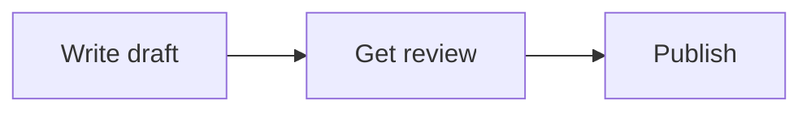

:::tip[How to invoke this skill]
Any of these triggers a diagram:

- `/visualize`
- `/diagram`
- "draw this out"
- "make a diagram"
- "i can't see the structure"
- "make a mermaid chart of this"
- "show me the flow visually"
- "map out the relationships"
:::

> Source: `packages/skills/visual-organizer/SKILL.md` is the canonical artefact. Frontmatter and triggers may change before v0.1.

A skill that turns dense text into a Mermaid diagram — flowchart, sequence, mindmap — when the user is overwhelmed by linear output or asks for visual organisation explicitly.

## Example output

A request like *"draw this out: I need to write the doc, get it reviewed, then publish it"* returns a single rendered Mermaid block of the shape below.

The skill emits exactly one fenced Mermaid block. No experimental syntax. Every node label stays under 40 characters so the diagram is legible at a glance.

## Frontmatter summary

| Field | Value |
|---|---|
| `name` | `visual-organizer` |
| `version` | `0.1.0` |
| `status` | `stable` |
| `neurotypes` | `["adhd", "audhd", "asd"]` |

## Triggers

- Slash command: `/visualise` (subject to skill-author finalisation).
- Semantic match against phrases like *"show me this as a diagram"*, *"too much text"*.

## MCP dependencies

None required. The skill is content-only — it instructs the model to emit a Mermaid block.

## Profile dependencies

- `preferences.motion` — diagrams are static; no animated diagrams ever.
- `preferences.reading_font_hint` — informs labelling.

## Acceptance

- Output contains exactly one Mermaid code block.
- Diagram is renderable in standard Mermaid (no experimental syntax).
- All node labels are under 40 characters.

## What's next

- [Concepts: skills](/concepts/skills/) for what content-only skills look like.
