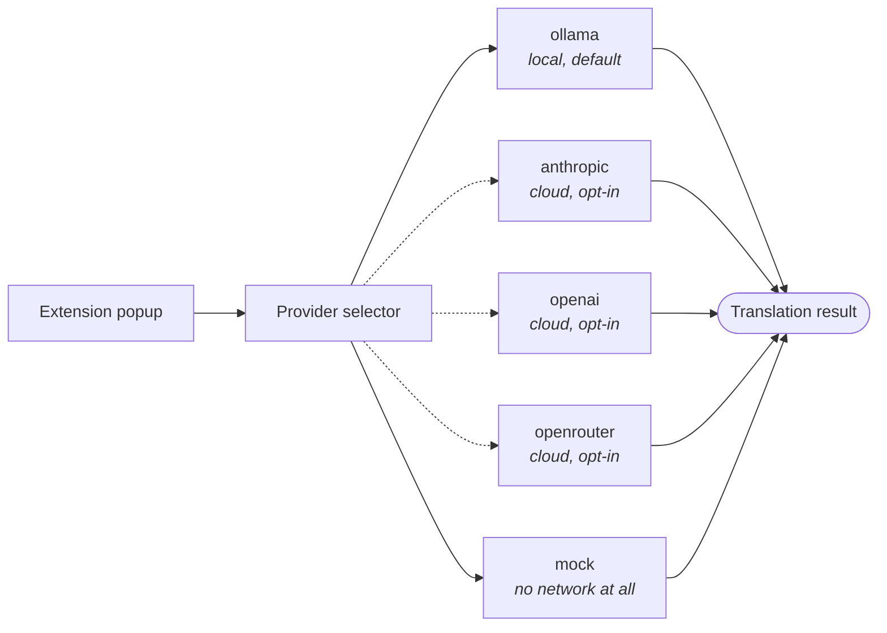

# @neurodock/extension-browser

The NeuroDock browser extension. Same translation prompts as `mcp-translation`, but available right inside Gmail, Slack, Linear, Notion, GitHub, Docs, and Outlook so you don't have to switch tabs to ask "what does this actually mean?". Manifest V3. Chrome, Edge, Firefox. Built with [WXT](https://wxt.dev).

This is the communication-layer surface of NeuroDock.

## Where your text goes

You write or select text in your browser. The extension sends it to one of five providers — your choice in the popup. The dashed lines are the cloud ones; you have to turn those on explicitly. The default is `ollama` (runs on your own laptop) or `mock` (no network at all).



## What it does (v0.0.2)

- Floats a non-intrusive "Translate" button on text fields across Gmail, Slack web, Linear, Notion, GitHub, Google Docs, and Outlook web.
- Adds a right-click context-menu action ("NeuroDock: translate selection") on any selected text within a permitted site.
- **0.0.14+: right-click any image** for "NeuroDock: describe image (vision)". Returns a literal description, transcribed text (for screenshots/charts/memes), key visual elements, the inferred purpose, and an alt-text suggestion. **Requires a vision-capable model** — see [Image translation: vision-model requirement](#image-translation-vision-model-requirement) below. Text-only models refuse with a clear `VISION_MODEL_REQUIRED` error.
- Opens a tabbed popup (Home / Settings) for mode selection, provider configuration, and history.
- Runs the five translation tools defined by the MCP twin (`translate_incoming`, `check_tone`, `rewrite_outgoing`, `brief_meeting`, `describe_image`) using the **same prompt library** as `packages/mcp-translation`.

## Image translation: vision-model requirement

The `describe_image` tool sends the image URL to the configured model. **The model must support image input** — otherwise the request is rejected up front with `VISION_MODEL_REQUIRED` and no partial / fabricated result is returned.

Models known to support image input:

| Provider   | Vision-capable models                                                                                                                                                                                 |
| ---------- | ----------------------------------------------------------------------------------------------------------------------------------------------------------------------------------------------------- |
| OpenAI     | `gpt-4o`, `gpt-4o-mini`, `gpt-4-turbo`, `gpt-4-vision-preview`, `o1`, `o3`, `o4`, future `gpt-5*`                                                                                                     |
| Anthropic  | `claude-3-*` family, `claude-haiku-4-*`, `claude-sonnet-4-*`, `claude-opus-4-*`                                                                                                                       |
| OpenRouter | `openrouter/auto` (routes to vision models when images are present), or pick a vision-capable upstream slug manually                                                                                  |
| Ollama     | `llava`, `bakllava`, `llama3.2-vision`, `moondream`, `minicpm-v` — **but the local lane currently rejects image input in v0.0.14; cloud-mode is the supported path**. Local vision lands in v0.0.15+. |
| LM Studio  | Same — vision support is Phase 2 work.                                                                                                                                                                |

Privacy: the image URL is passed verbatim to the model. The extension never downloads, caches, or logs the image bytes. Cloud-mode also fires the persistent cloud-mode banner so consent state stays visible.

- Dispatches real LLM calls through a single boundary (`translation-client.ts`) to one of five providers:

| Provider     | Mode  | Transport                                              | Default model      |
| ------------ | ----- | ------------------------------------------------------ | ------------------ |
| `ollama`     | local | HTTP NDJSON to `http://localhost:11434/api/generate`   | `llama3.2:3b`      |
| `anthropic`  | cloud | `@anthropic-ai/sdk` SSE via `messages.stream`          | `claude-haiku-4-5` |
| `openai`     | cloud | `openai` SDK SSE via `chat.completions.create`         | `gpt-4o-mini`      |
| `openrouter` | cloud | `fetch` SSE to `https://openrouter.ai/api/v1/chat/...` | `openrouter/auto`  |
| `mock`       | local | deterministic placeholder; no model call               | n/a                |

**Recommended default for cloud users:** `openrouter` with model `openrouter/auto` — OpenRouter's [auto-router](https://openrouter.ai/docs/guides/routing/routers/auto-router) picks an appropriate model per query so you get good translations without having to pick a model yourself.

### LM Studio not on localhost? (e.g. 169.254.x.x or a LAN IP)

Some systems can't bind LM Studio or Ollama to `localhost`. Windows in particular sometimes pins dev servers to a link-local APIPA address (`169.254.x.x`); other setups want to reach a Tailscale node or a LAN box. From v0.0.4 the extension supports this — without dropping back to `<all_urls>`.

**Why localhost is the default.** Local-first means local-by-default. The MV3 manifest only grants permission for `localhost` and `127.0.0.1` out of the box. Pointing at any other host requires your explicit per-host consent.

**How to grant permission.**

1. Open the extension popup → **Settings** tab.
2. Pick **Local LM Studio** (or **Local Ollama**).
3. Open the **Advanced** section and paste the non-localhost URL (e.g. `http://169.254.83.107:1234/v1`).
4. Click **Grant permission for `<origin>`** under the URL field. Approve the Chrome / Firefox prompt.
5. Use **Refresh models** and **Test connection** as usual. They will skip the prompt on subsequent clicks because Chrome persists the permission until you revoke it.

If you forget step 4, **Refresh models** and **Test connection** will pop the same Chrome prompt themselves — they all share the user-gesture grant path.

**How to revoke.** Settings → **Host permissions** → **Revoke** next to the origin.

**HTTPS local hosts (Tailscale, reverse proxies).** v0.0.4 only widens the CSP for `http://*:1234` and `http://*:11434`. If you need to reach a TLS local host, file an issue — we'd add the corresponding `https://*:port` entry on demand.

**Security model.** The CSP `connect-src` directive is widened with _port-restricted_ host wildcards (`http://*:1234` and `http://*:11434`) — not a host wildcard. The port is fixed to the two well-known LM Studio / Ollama dev-server ports. Even with the CSP widened, every fetch is still gated by `host_permissions`, so you have to explicitly grant each non-localhost host yourself. Chrome Web Store accepts this canonical pattern.

Provider responses are parsed defensively and validated with Ajv against the relevant MCP output schema; validation failures surface a `LLM_OUTPUT_VALIDATION_FAILED` envelope with a Retry path. The popup syncs its profile with `~/.neurodock/profile.yaml` via the optional `@neurodock/native-host` native messaging bridge; when the host is not installed, the profile lives only in `chrome.storage.local`.

### What v0.0.2 does NOT do (deferred to v0.0.3+)

| Feature                                           | Status                                                                            |
| ------------------------------------------------- | --------------------------------------------------------------------------------- |
| Browser store submission scripts                  | Deferred — this release ships as load-unpacked artefacts.                         |
| E2E Playwright suite against the loaded extension | Deferred — Vitest covers units.                                                   |
| `axe-core` automated runs in CI                   | Deferred — components are written to be a11y-clean and reduced-motion-by-default. |

## Privacy model

The extension defaults to **local mode** with **NO remote network calls**. Specifically:

- The default manifest requests host_permissions for the seven supported sites only. No `<all_urls>`. No third-party API origins by default.
- The user must explicitly enable cloud mode in the popup and confirm a provider id.
- When cloud mode is on, a persistent banner is rendered in the popup AND in every content-script island. It cannot be dismissed without switching back to local.
- History storage is off by default. When enabled, only metadata + a 256-character preview is stored. The DB is extension-scoped IndexedDB; no remote sync exists.

## Supported sites and content-script entrypoints

| Site        | Match                                                             | Entrypoint                       | Channel   |
| ----------- | ----------------------------------------------------------------- | -------------------------------- | --------- |
| Gmail       | `https://mail.google.com/*`                                       | `entrypoints/gmail.content.ts`   | `email`   |
| Slack web   | `https://app.slack.com/*`                                         | `entrypoints/slack.content.ts`   | `slack`   |
| Linear      | `https://linear.app/*`                                            | `entrypoints/linear.content.ts`  | `linear`  |
| Notion      | `https://www.notion.so/*`                                         | `entrypoints/notion.content.ts`  | `notion`  |
| GitHub      | `https://github.com/*`                                            | `entrypoints/github.content.ts`  | `github`  |
| Google Docs | `https://docs.google.com/*`                                       | `entrypoints/gdocs.content.ts`   | `gdocs`   |
| Outlook web | `outlook.live.com`, `outlook.office.com`, `outlook.office365.com` | `entrypoints/outlook.content.ts` | `outlook` |

## Architecture

```
entrypoints/
├── background.ts                  Service worker. Context menu + message router.
├── popup/                         React popup. Profile + history UI.
│   ├── index.html
│   ├── main.tsx
│   ├── App.tsx
│   └── styles.css
├── <site>.content.ts              One script per site. Calls bootstrapContent().
└── _shared/                       Shared content-script primitives.
    ├── bootstrap.tsx              Loads profile, mounts island, sends messages.
    ├── contentApp.tsx             Top-level React app for in-page UI.
    ├── floatingButton.tsx         Non-modal floating button.
    ├── panel.tsx                  Result panel with cloud-mode banner.
    ├── mountIsland.ts             Shadow DOM host + minimal style sheet.
    └── selectionWatcher.ts        Editable-focus + SPA-aware DOM observer.

Note: WXT discovers content scripts via the `*.content.[jt]s` glob at the
top of `entrypoints/`, so per-site scripts must live there, not in a
sub-directory. The shared module set is named `_shared` so WXT's discovery
glob skips it (leading underscore is treated as private).

src/
├── lib/
│   ├── translation-client.ts      The ONLY model boundary (mock / local / cloud).
│   ├── profile.ts                 Extension-scoped profile in chrome.storage.local.
│   ├── storage.ts                 Local-only IndexedDB history (off by default).
│   ├── cloud-mode-banner.tsx      Persistent cloud-mode banner (popup).
│   ├── types.ts                   Internal TypeScript surfaces.
│   └── prompts/                   Synced at build time from mcp-translation.
└── ...

scripts/
└── sync-prompts.ts                Copies prompts from mcp-translation. Runs pre-build.

tests/
├── setup.ts                       chrome.* shim, fake-indexeddb.
└── unit/                          Vitest units.
```

## Quickstart

From the repo root:

```sh
pnpm install
pnpm --filter @neurodock/extension-browser dev          # Chrome dev profile (auto-loads)
pnpm --filter @neurodock/extension-browser dev:firefox  # Firefox dev profile
pnpm --filter @neurodock/extension-browser dev:edge     # Edge dev profile
```

Production builds:

```sh
pnpm --filter @neurodock/extension-browser build        # all three targets
```

Output lands in `.output/<target>-mv3/`.

## Tests

```sh
pnpm --filter @neurodock/extension-browser test
```

Vitest covers:

- `profile.test.ts` — defaults, save/load, mode gating.
- `translation-client.test.ts` — mock mode, cloud-mode gating, URL channel detection.
- `selectionWatcher.test.ts` — editable detection, password-input ignored, focus events.
- `floatingButton.test.tsx` — render visibility, click + Enter activation, ARIA label.
- `cloud-mode-banner.test.tsx` — local renders nothing, cloud renders persistently.
- `storage.test.ts` — newest-first ordering, preview truncation.
- `sync-prompts.test.ts` — all four prompt files mirror from mcp-translation.

## Adding a new site

1. Create `entrypoints/<site>.content.ts` (top level — WXT does not recurse). Mirror an existing per-site script. Pick a channel from the enum in `src/lib/types.ts` (or use `"generic"`).
2. Add the site origin to `host_permissions` in `wxt.config.ts`.
3. Add a row to the table above.
4. Add a changeset entry.
5. The extension uses one mutation observer per page (in `selectionWatcher.ts`); you do not need to wire SPA detection yourself.

## Prompt sync

The four prompt templates live in `packages/mcp-translation/src/neurodock_mcp_translation/prompts/` as the canonical source. `scripts/sync-prompts.ts` copies them into `src/lib/prompts/` and `public/prompts/` before every WXT build. The copies are `.gitignore`d so there is no drift between the two surfaces. When the upstream prompts change, the extension picks them up on next build.

## Accessibility notes

- The popup uses Atkinson Hyperlegible (body), Lexend (headings), JetBrains Mono (code) with system-font fallbacks. Webfonts are never loaded from a remote CDN.
- The popup defaults to reduced motion via a `*` rule in `styles.css`. The `prefers-reduced-motion` media query is honoured.
- Every interactive control has an ARIA label and is keyboard navigable.
- Shadow DOM isolation prevents host-site CSS from overriding our focus rings.

## License

AGPL-3.0-or-later. See [LICENSE](../../LICENSE).
