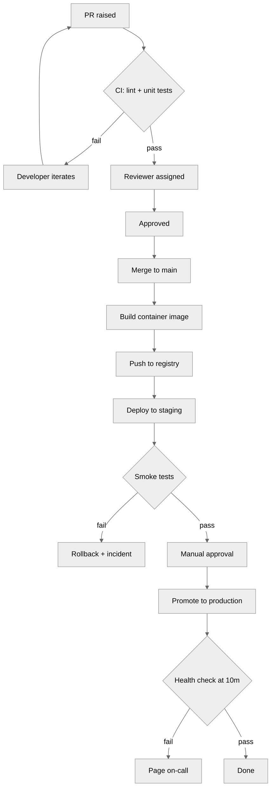

# Test 01 — flowchart from prose

## Profile

```yaml
preferences:
  motion: "normal"
```

## Trigger

User pastes the input and ends with: `/visualize`

## Input

> Our deploy pipeline runs like this. A developer raises a PR. CI runs lint and unit tests in parallel. If either fails, the PR is blocked and the developer iterates. If both pass, a reviewer is auto-assigned. Once the reviewer approves, the PR is merged to `main`. The merge triggers a build that produces a container image and pushes it to the registry. The image is then deployed to staging, where smoke tests run. If smoke tests fail, the deployment is rolled back and an incident is opened. If they pass, a manual approval gate stops the pipeline. A release manager approves, and the image is promoted to production. Production receives a post-deploy health check ten minutes later; failure pages the on-call.

## Expected output shape

```
<one sentence describing the diagram>



_Accessible description: A linear deploy pipeline from PR through CI, review, merge, staging smoke tests, manual approval gate, production promotion, and a 10-minute post-deploy health check with rollback and on-call paths on failure._
```

## Pass criteria

- Diagram type is `flowchart TD`.
- Node count between 6 and 25 inclusive (the example shows ~16; allow variance).
- At least two edges carry labels (e.g. `pass`, `fail`).
- At least one diamond decision node (`{...}`).
- Neutral theme directive present.
- `animation: false` is NOT required (profile motion is normal).
- Accessible description present, 20–200 chars.
