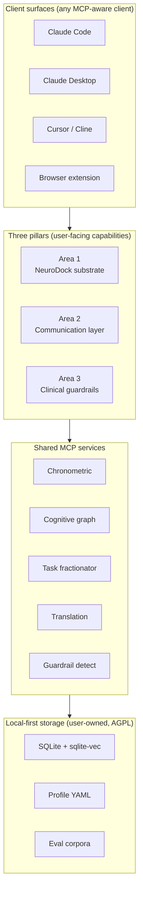
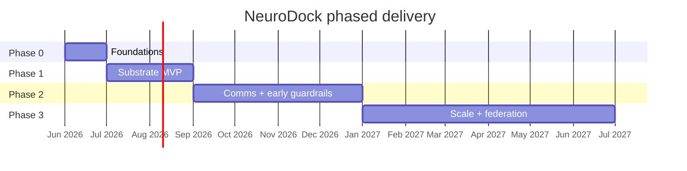

# NeuroDock — Build plan

**Version:** 0.1 (draft for RFC)
**Status:** Pre-launch / planning
**Owners:** Founding maintainers (TBD)
**Last updated:** 2026-05-15

---

## TL;DR

NeuroDock is an open-source, MCP-native, vendor-neutral, local-first cognitive substrate for neurodivergent professionals. It consolidates the currently-fragmented ecosystem of ADHD/ASD/OCD-supportive AI tooling into one composable stack, anchored by three pillars: a **substrate** of skills and MCP servers that externalise executive function, a **communication layer** that translates corporate ambiguity and modulates tone, and a **clinical guardrails** layer that prevents AI from amplifying rumination, hyperfocus, and sycophancy. The project is built **by** neurodivergent contributors **using** the very system being built, with lived-experience governance, burnout protocols, and a clinical advisory board.

This document is the master plan. Operational execution is delegated to a fleet of fifteen Claude Code subagents whose specifications live in `.claude/agents/` and are referenced throughout.

---

## 1. Manifesto

Five principles. Non-negotiable. Every architectural, design, governance, and product decision is judged against them.

1. **Lower friction for users, and for contributors.** Every install, every PR, every skill must be addable in under fifteen minutes. The cost of participation is the cost of contribution.
2. **Local-first by default; cloud is opt-in.** Neurodivergent telemetry never leaves the user's machine without an explicit consent action per scope.
3. **Lived experience leads.** Reviewers with the relevant neurotype have final say on artefacts targeted at that neurotype. Self-identification is sufficient — diagnosis is never a gate.
4. **Composable over monolithic.** No god-modules. Profiles, skills, MCP servers, and plugins are swappable units.
5. **Refuse where appropriate.** We build clinical guardrails into the substrate. AI that fuels rumination, hyperfocus, or anxiety is a regression, not a feature.

---

## 2. Brand and positioning

**Name:** `NeuroDock`. The dock metaphor lines up with MCP's "USB-C for AI" framing — the place where executive function plugs in.

**Positioning:** Open-source cognitive infrastructure for neurodivergent professionals. Local-first, vendor-neutral, built with — not for — the people who need it.

**Typography:** `Atkinson Hyperlegible` (body), `Lexend` (headings), `JetBrains Mono` (code). Both Atkinson and Lexend are evidence-based for dyslexia and ADHD readability and free for redistribution.

**Voice:** Direct, plain, non-clinical, never patronising. Avoid "superpower", "differently abled", "challenges". Use "ND professionals" or be specific (ADHD, autistic, OCD).

**Visual language:** Two colour modes at launch — calm light and dim dark — plus high-contrast and reduced-motion variants. No animation by default. Single neutral hue for the logomark. Generous line-height (≥ 1.65). No gradients, no decorative flourishes.

---

## 3. Unified architecture



**How the layers compose.** A user runs Claude Desktop on their laptop. NeuroDock is installed locally via `npx neurodock init`. The desktop client sees a set of MCP servers (chronometric, cognitive-graph, translation, guardrail-detect, task-fractionator). The user's profile YAML (`~/.neurodock/profile.yaml`) tells the substrate which skills to activate and which guardrail thresholds apply. When the user starts a session, the substrate injects time context, recalls relevant entities, and registers the guardrail middleware. The experience feels like "Claude that knows me", not "I installed twenty things."

**Backward compatibility.** Every MCP server publishes a versioned schema. Breaking changes ship behind a new major version and never collapse old behaviour silently. Profiles are forward-compatible YAML — new fields default to safe values for older installs.

**Vendor neutrality.** No code path in the core depends on a specific LLM vendor. Adapters for Anthropic (default), OpenAI, and local Ollama / LM Studio live behind a single interface. CI tests at least two vendors per release.

---

## 4. Tech stack

| Layer | Choice | Why |
|---|---|---|
| MCP servers | FastMCP (Python) primary; `@modelcontextprotocol/sdk` (TS) where browser context required | FastMCP is the cleanest Python idiom for MCP today; TS for service-worker contexts only. |
| Local storage | SQLite + `sqlite-vec` for combined relational + vector; SQLCipher when user requests at-rest encryption | One file, zero ops, runs everywhere. Vector and relational in one place. |
| Event log | JSONL append-only | Cheap to inspect, cheap to repair, mirrors the `kipi-system` pattern that works. |
| Embeddings | Default local (`nomic-embed-text-v1.5` via Ollama, or `gte-small` via `fastembed-py`); opt-in cloud (Voyage, OpenAI) | Local-first principle. Cloud only with explicit consent. |
| LLM access | Via the user's MCP client; no universal wrapper in core | Avoids vendor lock-in; the MCP client is the LLM boundary. |
| Browser extension | WXT (Vite-based, MV3) + React 18 + Tailwind | Currently the cleanest cross-browser MV3 toolkit. |
| CLI / installer | Node 22+ with `commander`, distributable via `npx` | Lowest-friction onboarding path. |
| Monorepo tooling | `pnpm` workspaces + `uv` workspaces + Turborepo for caching | Two-ecosystem reality requires two workspace tools; Turborepo unifies caching. |
| Versioning | Changesets per package, semantic versioning, independent versions | Independent package velocity. |
| Docs | Astro Starlight with Atkinson Hyperlegible | Accessible, fast, easy to contribute to. |
| Testing | `pytest` + `vitest` + Playwright for E2E + axe-core for a11y | Standard layers; Playwright critical for browser extension. |
| CI/CD | GitHub Actions, per-package matrix | Free for OSS, integrated everywhere. |
| Supply chain | Dependabot, CodeQL, `pip-audit`, `npm audit`, SLSA L2 provenance | Standard expectations for serious OSS. |
| Telemetry | Off by default; local OpenTelemetry traces only if user opts in | No remote telemetry endpoints in default config. |

---

## 5. Repository structure

Single monorepo under `github.com/neurodock`. Independent versioning per package. The structure is the contribution surface.

```
neurodock/
├── MANIFESTO.md
├── README.md
├── CONTRIBUTING.md
├── CODE_OF_CONDUCT.md
├── GOVERNANCE.md
├── SECURITY.md
├── ETHICS.md
├── packages/
│   ├── core/                       # Shared types, profile schema, plugin protocol
│   ├── cli/                        # `neurodock` installer + diagnostic CLI
│   ├── mcp-chronometric/           # Time + idle + break server
│   ├── mcp-cognitive-graph/        # Persistent entity graph + vector recall
│   ├── mcp-task-fractionator/      # Goblin-style task decomposer
│   ├── mcp-translation/            # Tone + literal-translation server
│   ├── mcp-guardrail/              # Rumination + sycophancy detection
│   ├── skills/                     # Bundle of Claude skills
│   │   ├── adhd-daily-planner/
│   │   ├── audhd-context-recovery/
│   │   ├── asd-meeting-translator/
│   │   ├── ocd-decision-finalizer/
│   │   ├── hyperfocus-formatter/
│   │   └── visual-organizer/
│   ├── extension-browser/          # Chrome/Edge/Firefox extension
│   ├── clinical/                   # Guardrail detector library (importable)
│   └── evals/                      # Versioned eval corpora + harness
├── plugins/                        # Third-party-friendly: skills, servers, packs
├── profiles/                       # Curated profile presets
├── docs/                           # Astro Starlight site
├── examples/                       # End-to-end demos per client
├── scripts/                        # Repo-wide tooling
├── .github/
│   ├── workflows/
│   ├── ISSUE_TEMPLATE/
│   ├── PULL_REQUEST_TEMPLATE.md
│   └── CODEOWNERS
├── .claude/
│   ├── agents/                     # The fifteen subagents (see Section 11)
│   ├── skills/                     # Project-specific dev skills
│   └── settings.json
├── pnpm-workspace.yaml
├── pyproject.toml
└── turbo.json
```

### Plugin protocol

Anything in `plugins/` follows one contract: a `plugin.yaml` manifest declaring name, type (`skill | mcp-server | profile | translation-pack | language-pack`), version, neurotype tags, and trust level. The substrate auto-discovers plugins matching the user's profile. Authoring a new plugin requires zero core changes — fork, add a directory, PR.

### Skill SDK

Two small libraries — `@neurodock/skill-sdk` (TS) and `neurodock-skill` (Py) — expose helpers for distress-signal detection, profile-aware formatting, "Answer First" output shaping, and the standard hook protocol. Authors write skill code against the SDK, not raw Claude conventions, so skills remain portable.

---

## 6. Area 1 — NeuroDock substrate

**Scope.** Everything that externalises executive function: time awareness, persistent memory, task decomposition, profile-driven adaptation, "Answer First" formatting, visual organisation, the skill library.

### MCP server specifications

**`mcp-chronometric`** — Time, idle, break management.

| Tool | Returns |
|---|---|
| `get_time_context()` | `{now, day_of_week, time_since_last_prompt, current_session_length, energy_zone}` |
| `mark_session_start(intent: str)` | Session id; anchors a unit of work with stated intent |
| `mark_session_end(summary?: str)` | Session metadata; closes the unit |
| `request_break_if_needed(threshold_minutes: int)` | `null` or `{elapsed, prior_intent, suggested_action}` |
| `idle_status()` | OS idle time (consent-gated); distinguishes hyperfocus elsewhere vs distraction |

**`mcp-cognitive-graph`** — Persistent memory and recall.

| Tool | Returns |
|---|---|
| `recall_entity(name_or_alias: str)` | All known facts about person/project/decision/concept |
| `record_fact(subject, predicate, object, source?, confidence?)` | Stored fact id |
| `recall_decisions(project: str, since?: date)` | Decision list, ordered by date |
| `weekly_rollup(project?: str)` | Auto-generated activity summary |

**`mcp-task-fractionator`** — Decomposition and next-action.

| Tool | Returns |
|---|---|
| `decompose(goal: str, time_budget?: str)` | Atomic 5–90 min tasks with acceptance criteria, sequenced and dependency-tagged |
| `next_one(project: str)` | Exactly one task with reasoning |

### Launch skills (six)

1. **`adhd-daily-planner`** — Morning ritual; pulls overnight changes; generates 1–3 things that matter today; schedules buffer transitions between calendar events.
2. **`audhd-context-recovery`** — `/resume` command; reconstructs yesterday's mental state from the cognitive graph.
3. **`asd-meeting-translator`** — Transcript → structured "explicit asks of me / explicit asks of others / things left ambiguous". Hooks Area 2.
4. **`ocd-decision-finalizer`** — On repeat-validation requests, enforces decision-finality response. Hooks Area 3.
5. **`hyperfocus-formatter`** — "Answer First" output structure; activates on long sessions when distress signals appear.
6. **`visual-organizer`** — Mermaid generation for overwhelm states.

Each skill ships a `SKILL.md` with standard frontmatter plus a `tests/` directory with ≥ 3 example invocations replayed in CI.

### Profile system

`~/.neurodock/profile.yaml`:

```yaml
identity:
  display_name: "T"
  neurotypes: ["adhd", "asd"]
preferences:
  output_format: "answer_first"
  max_chunk_size: 5
  reading_font_hint: "atkinson_hyperlegible"
  motion: "reduced"
chronometric:
  hyperfocus_break_minutes: 90
  end_of_day_local: "18:30"
guardrails:
  rumination_threshold: 3
  sycophancy_check: "warn"
privacy:
  embeddings: "local"
  telemetry: "off"
```

Profiles are composable. Curated presets ship in `profiles/`. Changes are immediate; no restart.

### User stories

| As a... | I want... | Acceptance |
|---|---|---|
| PM with ADHD | A Monday-morning brief of every project I touch, blockers, and one next-action | `/resume monday` runs in ≤ 5s against a 30-day graph; brief names projects, decisions, one action with confidence > 0.7 |
| AuDHD founder | A hard interrupt at 90 min after 6pm, surfacing my own stated intent | Nudge fires at threshold; quotes user's prior statement verbatim; respects one "snooze 15m" before escalating |
| Director with ADHD | Voice-dump a vague initiative and get back 7 atomic tasks plus the single next one | `decompose` returns 5–12 tasks; `next_one` returns exactly one with rationale; 80%+ of pilots rate it "I can start now" |

### Contribution path

Fork → `packages/skills/<name>/` → SKILL.md + ≥ 3 test invocations → PR. CI lints frontmatter, runs invocations against a reference client, checks accessibility heuristics. Two reviewers required: one core maintainer + one with the lived experience tagged.

---

## 7. Area 2 — Communication and translation layer

**Scope.** Bidirectional translation of corporate communication. Literal-translate incoming subtext. Tone-check outgoing messages. Structure meeting transcripts into explicit asks. Ships as **one browser extension + one MCP server** backed by the same prompt library and eval corpus.

### Browser extension architecture

- Manifest V3, WXT-built.
- **Content script:** floating button on text fields in Gmail, Slack web, Linear, Notion, GitHub, Google Docs, Outlook web. Context-menu action on selected text anywhere.
- **Popup:** profile settings, local-only history, local-vs-cloud toggle.
- **Service worker:** routes requests; supports local Ollama via native messaging or cloud provider with explicit user config.
- **No remote backend by default.** The extension is a client-to-model orchestrator.

### MCP twin

The same prompts live in `mcp-translation`, usable inside Claude Code for PR review and Claude Desktop for email drafting. One prompt repository, one eval corpus, one test harness.

### Privacy model

Default mode: local only. Local Ollama, no network calls, conversation history in extension-scoped IndexedDB. Cloud mode requires an explicit user action and shows a persistent "cloud mode" banner until switched off. Translation requests never logged remotely.

### Eval corpus

Versioned, consented dataset on HuggingFace under the `neurodock` org. Real corporate messages, tagged by ND professionals with: literal-meaning, implicit-asks, ambiguity-confidence, tone-axis ratings. Strict contribution rules: anonymisation required, opt-in only, author consent verified. Target: 1,000 examples by month 6. Every prompt change runs against the eval suite in CI.

### User stories

| As a... | I want... | Acceptance |
|---|---|---|
| Autistic engineering director | One-click translation of "can we revisit X" with confidence flag if ambiguous | Output in ≤ 4s; three sections (explicit ask, likely subtext + confidence, recommended next action); ND raters agree ≥ 75% on the eval set |
| ADHD PM | Tone reading on a sharp PR comment, flagging blunter-than-baseline phrases | Returns directness/warmth/urgency on 0–100 axis; flags phrases with thread-baseline delta > 25%; rewrite preserves all technical terms |
| Director after 60-min strategy meeting | Four-section brief from the transcript: my asks, others' asks, decisions, ambiguous items | Ambiguous items quote the exact transcript span; ND raters report ≥ 80% capture of perceived asks on a 30-meeting pilot |

### Contribution paths

Four lanes for outside contributors:

- **Prompt improvements** against the eval suite — measurable, low-ceremony.
- **Eval examples** — consented, anonymised messages with ratings; most welcoming for non-coders.
- **Language packs** — translation prompts for specific corporate-culture / language pairs (Hiberno-English, German directness norms, Japanese *keigo*).
- **Domain packs** — engineering review, legal correspondence, customer success.

---

## 8. Area 3 — Clinical guardrails

**Scope.** A middleware layer that detects and intervenes on three specific failure modes of unmodified LLM interaction for neurodivergent users: rumination loops (OCD), unregulated hyperfocus (ADHD), and sycophancy / over-validation. All interventions are transparent, user-configured, overridable.

### The three detectors

**Rumination detector.** Rolling window of recent semantic intents using local embeddings. When N semantically-equivalent queries arrive within a configured window, the detector flags the conversation. `check_rumination` returns a structured signal any skill can respect. Default: 3 queries within 90 minutes. Configurable. Never blocks silently — always surfaces the reason.

**Hyperfocus monitor.** Uses chronometric data; optionally consents to OS idle status. Escalating interventions: 60 min → gentle context inject; 90 → structured nudge quoting user's previously-stated end-time; 120 → hard surface. Thresholds pre-set out of session — consent at setup, not under duress.

**Sycophancy / anti-validation guard.** Detects (a) repeated reassurance requests on the same decision and (b) responses skewing toward unconditional agreement on subjective questions. Injects a counter-prompt instructing the model to ground in prior evidence, name trade-offs honestly, or refuse. User sees a small marker that the guard fired and why.

### Clinical advisory model

Five-person rotating board, two-year staggered terms. Composition: at minimum one psychologist with ND specialism, one CBT/ERP practitioner, one occupational therapist, two practitioners with relevant lived experience. Quarterly review of heuristics, thresholds, position paper. Advisory — not veto. Council decides; advisors advise.

### Ethics framework (`ETHICS.md`)

1. We never claim to treat any condition.
2. We never block a user's action without their pre-configured consent.
3. Detection heuristics are public and auditable.
4. We do not aggregate detection events into population-level data.
5. False positives are sometimes harmful; we log when surfaced and adjust with the advisory board.

### User stories

| As a... | I want... | Acceptance |
|---|---|---|
| Engineer with OCD | On the 4th re-validation of the same module today, get a grounded decision-finality response, not more analysis | Detector fires at request 4; response cites validation timestamp and prior evidence; `--override "fresh-context"` available, logged locally only |
| PM with ADHD | At 11:08pm after my 11pm-asleep commitment, get my own words back, not a vague nudge | Nudge quotes prior statement verbatim with timestamp; two options ("commit and close" / "snooze 15m then stronger nudge") |
| Anxious autistic engineer | On the 3rd "is this okay?", get a polite refusal to re-validate plus a summary of prior reasoning | Sycophancy guard fires; response includes "what we already established"; assistant declines further validation on this decision unless new information provided |

### Field study (gates general release of guardrails)

Recruit 30–50 ND professionals via Leantime community, r/ADHD_Programmers, existing skill author network (`ravila4`, `nextor2k`, `assafkip`, `JackReis`). Eight-week pilot. Measure: helpfulness (Likert), perceived condescension (Likert), false-positive rate, qualitative open-text. Publish results before guardrails leave beta.

---

## 9. CI/CD and engineering hygiene

### Branch strategy

- Trunk-based on `main`.
- Short-lived branches: `feat/<area>/<short>`, `fix/<area>/<short>`, `docs/<area>/<short>`.
- Long-running spikes: `experiment/<topic>` — never merged directly; graduate to feature branch.
- Release branches `release/v<major>.<minor>` cut from `main` only on extended stabilisation (rare).
- Conventional commits, enforced via `commitlint` on PR title.

### CI workflows (GitHub Actions)

1. **Per-PR validation** — matrix-builds only touched packages via Turborepo filtering. Runs lint (ruff + eslint), type-check (mypy + tsc), unit tests (pytest + vitest), MCP protocol conformance against a frozen reference client, skill-and-eval smoke suite.
2. **Release on tag** — Changesets-driven; tag `vX.Y.Z` on a package → publish to npm or PyPI + GitHub release with auto-generated notes.
3. **Browser extension** — separate workflow building Chrome, Firefox, Edge bundles. Signed. Submitted to stores via API on tag.

### Security and supply chain

- Dependabot for npm + PyPI.
- CodeQL on every PR.
- `pip-audit` and `npm audit` as gating checks.
- SLSA Level 2 provenance attestations on all released artefacts.
- Signed commits enforced for the maintainer council.
- No remote pre-commit hooks (would break airplane-mode development).

### Testing layers

| Layer | Tool | Where it runs |
|---|---|---|
| Unit | pytest, vitest | Per-package, per-PR, fast |
| Integration | Custom MCP conformance harness | Per-PR on touched packages |
| End-to-end | Playwright | Nightly + before release |
| Eval | Custom harness against versioned corpora | Nightly + per-PR if prompts touched |
| Accessibility | axe-core + manual NVDA/VoiceOver | Per-PR + before minor releases |
| Lived-experience UAT | Rotating volunteer pool (10–15) | One week before each tagged release |

### Internationalisation

Strings extracted via ICU MessageFormat from day one. English source; community translates. Locale-specific prompt packs ship separately from UI strings.

---

## 10. The build-time agent fleet

The project is itself built and maintained by a fleet of fifteen Claude Code subagents, specified in `.claude/agents/`. Each agent has a single clear scope, a defined trigger, and explicit outputs. Contributors interact with `orchestrator`, which dispatches to specialists.

### Agent index

| # | Agent | Phase | Primary purpose |
|---|---|---|---|
| 1 | [`orchestrator`](.claude/agents/orchestrator.md) | All | Meta-dispatcher; routes contributor requests to specialists |
| 2 | [`repo-bootstrapper`](.claude/agents/repo-bootstrapper.md) | 0 | Stands up the monorepo scaffold, CI, governance files |
| 3 | [`governance-author`](.claude/agents/governance-author.md) | 0 | Drafts and maintains MANIFESTO, GOVERNANCE, CODE_OF_CONDUCT, ETHICS |
| 4 | [`mcp-architect`](.claude/agents/mcp-architect.md) | 1, 2, 3 | Designs and reviews MCP tool schemas; backward-compat enforcement |
| 5 | [`mcp-server-builder`](.claude/agents/mcp-server-builder.md) | 1, 2, 3 | Implements MCP server packages |
| 6 | [`skill-author`](.claude/agents/skill-author.md) | 1+ | Scaffolds, reviews, and refines skills |
| 7 | [`browser-extension-builder`](.claude/agents/browser-extension-builder.md) | 2 | Builds and maintains the WXT-based extension |
| 8 | [`eval-curator`](.claude/agents/eval-curator.md) | 2, 3 | Manages eval corpora — anonymisation, consent, dedup, quality |
| 9 | [`clinical-reviewer`](.claude/agents/clinical-reviewer.md) | 3 | Interfaces with clinical advisory; gates guardrail changes |
| 10 | [`design-system-keeper`](.claude/agents/design-system-keeper.md) | All | Enforces typography, colour, copy tone on UI and skill output |
| 11 | [`accessibility-auditor`](.claude/agents/accessibility-auditor.md) | All | a11y enforcement; "ND readability" pass |
| 12 | [`doc-writer`](.claude/agents/doc-writer.md) | All | Keeps docs in sync with code |
| 13 | [`release-pilot`](.claude/agents/release-pilot.md) | 1+ | Walks humans through cutting releases |
| 14 | [`community-triage`](.claude/agents/community-triage.md) | 0+ | Triages issues/PRs; welcomes new contributors |
| 15 | [`changelog-keeper`](.claude/agents/changelog-keeper.md) | All | Ensures Changesets entries exist for user-facing changes |

### How the fleet operates

Every PR triggers a subset of agents based on which packages changed. The orchestrator decides. Agents leave structured comments, gating where appropriate, advisory otherwise. Humans always have final say on merge. Agents are tools, not authorities.

---

## 11. Phased roadmap



### Phase 0 — Foundations (month 1)

**Outcome.** Public scaffold, governance live, founding contributors and advisors confirmed.

**Deliverables.**

- `github.com/neurodock` reserved; namespaces locked on npm, PyPI, OpenCollective.
- Domain `neurodock.org` purchased.
- `MANIFESTO.md`, `CODE_OF_CONDUCT.md`, `GOVERNANCE.md`, `ETHICS.md` published.
- Monorepo scaffold with empty packages and green CI from commit one.
- RFC issue open: "Founding scope and architecture".
- Outreach to maintainers of `ravila4/claude-adhd-skills`, `nextor2k/hyperfocus`, `assafkip/kipi-system`, `JackReis/neurodivergent-visual-org` — invitation to participate, not fork.
- Clinical advisory board: target 3 commitments, minimum 2.

**Agents in play.** `repo-bootstrapper`, `governance-author`, `community-triage`, `orchestrator`.

**Exit criteria.** Scaffolded repo. Governance documents merged. ≥ 3 external contributors signed up. ≥ 2 clinical advisors confirmed.

### Phase 1 — Substrate MVP (months 2–3)

**Outcome.** Developer preview — `v0.1` shipping. Substrate provably works end-to-end.

**Deliverables.**

- `mcp-chronometric` v0.1 (all five tools).
- `mcp-cognitive-graph` v0.1 (all four tools).
- Five of six launch skills (deferring `asd-meeting-translator` to Phase 2 since it needs the translation layer).
- Profile system v0.1.
- `npx neurodock init` working for Claude Code and Claude Desktop on macOS / Linux / Windows.
- Documentation site live at `docs.neurodock.org`.
- First public release: `v0.1` developer preview.

**Agents in play.** `mcp-architect`, `mcp-server-builder`, `skill-author`, `design-system-keeper`, `accessibility-auditor`, `doc-writer`, `release-pilot`, `community-triage`, `changelog-keeper`.

**Exit criteria.** 100 installs. 10 contributors. Eval suite green. Three lived-experience UAT cycles complete with no severe negative signal.

### Phase 2 — Communication layer and early guardrails (months 4–7)

**Outcome.** Browser extension public beta. Translation MCP server stable. Guardrails detection alpha (rumination only).

**Deliverables.**

- `mcp-translation` v0.1.
- `extension-browser` beta on Chrome and Firefox stores.
- Eval corpus at 300 examples (anonymised, consented).
- `asd-meeting-translator` skill (depends on translation server).
- `mcp-guardrail` v0.1 with rumination detection only.
- Field study for guardrails kicks off in month 6.

**Agents in play.** Adds `browser-extension-builder`, `eval-curator`, `clinical-reviewer`.

**Exit criteria.** 1,000 installs. 25 contributors. Browser extension shipping with > 4-star reviews. Guardrail field study at the halfway point with no severe negative signal.

### Phase 3 — Scale and federation (month 8+)

**Outcome.** All three guardrail detectors live. Public position paper. Plugin marketplace operational. Sustainable funding model.

**Deliverables.**

- All three guardrail detectors (rumination, hyperfocus, sycophancy) live.
- Public position paper on ND-safe AI use published to arXiv and the project blog.
- Plugin marketplace at `plugins.neurodock.org` — third-party skills, MCP servers, profiles, translation packs.
- Federated skill registry — community-maintained, signed, opt-in.
- Language packs for ≥ 3 locales.
- Funding model live (GitHub Sponsors, Open Collective, supporter-company tier).

**Exit criteria.** 10,000 monthly active installs. 50+ contributors. 100+ third-party plugins. Sustainable maintainer rotation with no solo bus factors.

---

## 12. Governance and community

### Maintainer council

Five seats, two-year staggered terms. At least three seats reserved for contributors with relevant lived experience (self-identified). Decisions by simple majority on routine matters; consensus required on changes affecting manifesto, ethics, or governance itself. Documented escalation path when consensus fails.

### Lived-experience-first contribution

`CODEOWNERS` ensures skills targeted at a specific neurotype are reviewed by at least one contributor with that neurotype. Self-identification sufficient.

### Burnout protocol

Maintainers can declare AFK with no questions asked. Reviews automatically reassign. No solo bus factors — every package has ≥ 2 CODEOWNERS. Quarterly retros include explicit "how is everyone holding up" agenda item.

### Code of conduct additions

Beyond CC4.0 base, three explicit ND-aware additions:

1. Direct communication is welcomed and not pathologised.
2. Requests for explicit clarification are not interpreted as aggression.
3. Latency in async response is normalised; no contributor owes immediate availability.

### Funding

GitHub Sponsors and Open Collective from day one. No commercial paid tier from the project itself. Long-term sustainability through partnership with employers whose ND staff benefit (supporter-company tier pays for advisory hours, not features). Anthropic Builders grant application once Phase 1 is shipping.

---

## 13. Success metrics

Three categories, tracked publicly on a dashboard.

### Adoption

- Monthly active installs (telemetry-free count via voluntary phone-home + download counts as proxy).
- Browser extension store rating.
- Number of profiles in active use.

### Quality

- Eval corpus scores per release.
- Guardrail false-positive rate from field study (target: < 5%).
- Skill test pass rate.
- Time from open issue to first response (target: < 48 hours).

### Outcome (carefully framed)

- Self-reported "I shipped work I otherwise wouldn't have" in quarterly survey.
- Explicit "no change" and "made things worse" categories tracked equally.
- **We do not measure productivity in hours, lines of code, or throughput.** That path leads to surveillance and is incompatible with the manifesto.

---

## 14. Risks and mitigations

| Risk | Mitigation |
|---|---|
| Scope creep | Phased roadmap with hard exit criteria; council can vote down phase-violating changes |
| Maintainer burnout | Burnout protocol; ≥ 2 CODEOWNERS per package; intentional contributor on-ramp |
| Clinical liability | Clear "not treatment" framing; ETHICS framework; transparent overridable guardrails; ongoing advisory |
| Vendor changes (MCP semantics, Claude pricing) | Vendor-neutrality from day one; compatibility matrix tested in CI across ≥ 2 vendors |
| Sycophancy contagion in reviews | Explicit review-quality guidelines; `design-system-keeper` and `accessibility-auditor` as non-emotional reviewers |
| Funding collapse | Deliberately small core team; OSS continues at low intensity even with zero funding; supporter-company partnerships |

---

## 15. Concrete actions for the next 30 days

### Week 1 — Reservations and RFC

- Reserve `neurodock` on GitHub, npm, PyPI, OpenCollective. Buy `neurodock.org`.
- `governance-author` drafts `MANIFESTO.md` and `GOVERNANCE.md` as public RFC.
- Open single GitHub issue: "RFC: founding scope" pointing at the manifesto.
- Send personal outreach to `ravila4`, `nextor2k`, `assafkip`, `JackReis`. Invitation, not announcement.

### Week 2 — Scaffold

- `repo-bootstrapper` lands the monorepo scaffold with green CI from commit one.
- `mcp-server-builder` starts `mcp-chronometric` — simplest server, proof of architecture.
- Identify three clinical advisor candidates; first conversations scheduled.
- `eval-curator` opens empty HuggingFace dataset with contribution guide.

### Week 3 — First skill end-to-end

- `mcp-server-builder` completes `mcp-chronometric` v0.0.1.
- `skill-author` lands `adhd-daily-planner` end-to-end with three test invocations.
- `accessibility-auditor` passes the skill.
- Recruit five lived-experience UAT volunteers from existing network.
- `doc-writer` lands first version of `docs.neurodock.org`.

### Week 4 — Soft launch as RFC

- Public position write-up: "What we are building and why."
- Post to Hacker News, Leantime community, Anthropic Discord, relevant subreddits, LinkedIn.
- Begin Anthropic Builders relationship conversation — not yet a grant ask.
- Month exits with: 50 stars, 10 committed contributors, 2 confirmed clinical advisors, end-to-end demo of one skill against chronometric server.

---

## 16. References and prior art

This project explicitly builds on, and aims to consolidate, the following:

- [`Leantime/leantime`](https://github.com/Leantime/leantime) — ADHD/autism/dyslexia-focused project management with MCP server.
- [`ravila4/claude-adhd-skills`](https://github.com/ravila4/claude-adhd-skills) — Claude Code skills + hooks for ADHD development workflow.
- [`nextor2k/hyperfocus`](https://github.com/nextor2k/hyperfocus) — ADHD-friendly output formatting via Claude Code hooks.
- [`JackReis/neurodivergent-visual-org`](https://github.com/JackReis/neurodivergent-visual-org) — Mermaid-based visual organization.
- [`assafkip/kipi-system`](https://github.com/assafkip/kipi-system) — Multi-tiered external memory architecture for AuDHD.
- [`AlexChesser/ail`](https://github.com/AlexChesser/ail) — Deterministic shell wrapping for AI loops.
- [`WenXiaoWendy/cyberboss`](https://github.com/WenXiaoWendy/cyberboss) — Stochastic pulse daemon pattern.
- [`orual/pattern`](https://github.com/orual/pattern) — Multi-agent cognitive support with MemGPT-style memory.
- [`elsahafy/ux-mcp-server`](https://github.com/elsahafy/ux-mcp-server) — UX heuristic MCP server including neurodiversity guidelines.
- Microsoft Copilot accessibility studies (UK Department for Business and Trade, 2025).
- EY Neuro-Diverse Centers of Excellence research (Shukla et al.).
- `Psychopathia.ai` framework for AI clinical safety.
- HuggingFace CALMED dataset; AttentionGuard research.

Where we adopt patterns from these projects, we credit and link. Where we differ, we document the reason in an ADR.

---

## Appendix A — Vocabulary

- **MCP** — Model Context Protocol. The Anthropic-introduced standard for connecting LLMs to external tools and data.
- **Skill** — A scoped instruction-and-asset bundle that activates on specific triggers within a Claude client. Follows `SKILL.md` frontmatter convention.
- **Profile** — A YAML manifest declaring a user's preferences, neurotypes, thresholds, and privacy choices.
- **Plugin** — Third-party-contributed unit (skill, MCP server, profile, language pack) discovered automatically by the substrate.
- **ND** — Neurodivergent. Project-default umbrella term.
- **Lived experience** — Self-identified relevant first-person experience of a neurotype. Sufficient for review authority on relevant artefacts; diagnosis never required.
- **Council** — The five-person maintainer body with decision authority.
- **Advisory** — The five-person clinical advisory board. Advises; does not vote.

---

*End of plan.*
